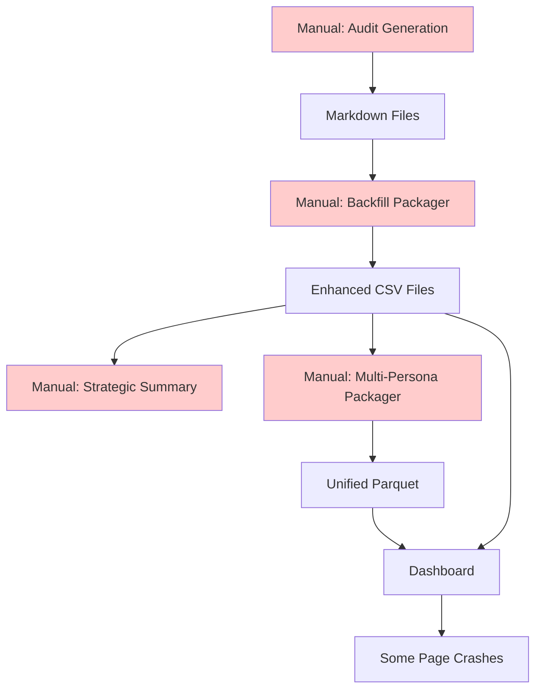
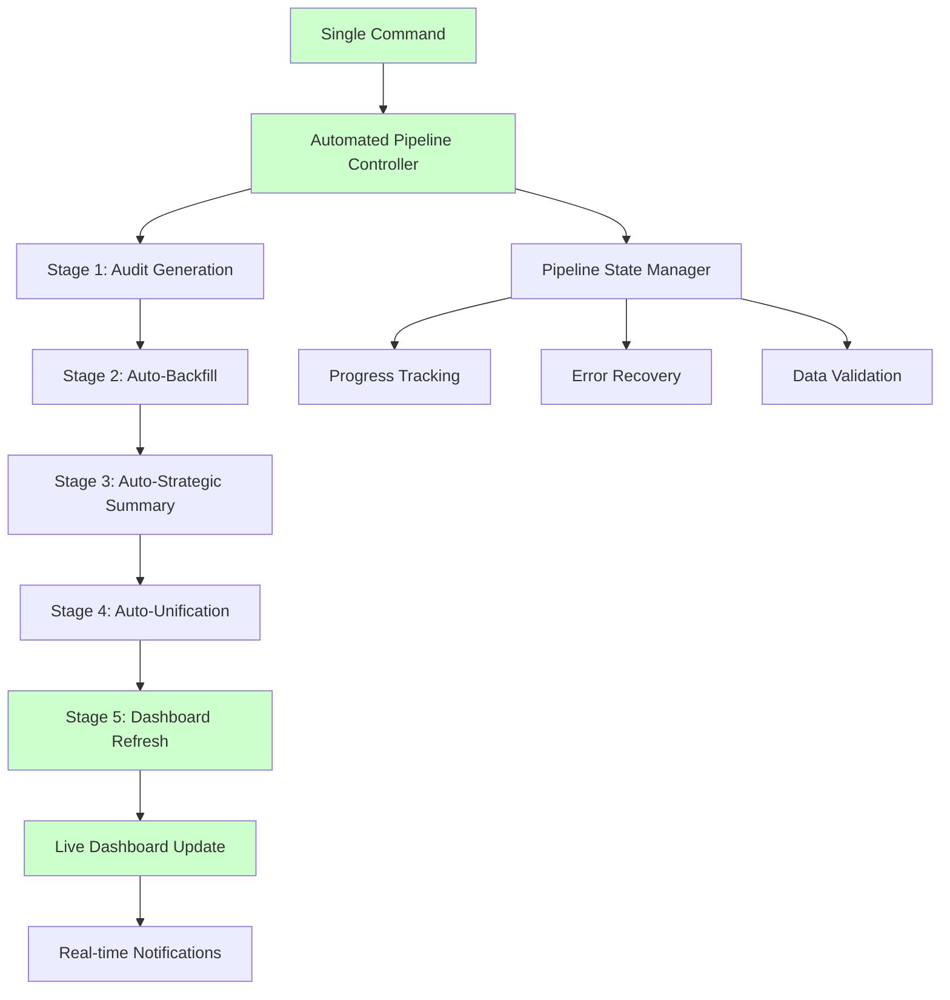

# Sopra Steria Brand Audit Data Strategy & Pipeline Documentation

## Executive Summary

The brand audit data pipeline transforms raw audit outputs into unified analytics datasets through a four-stage process. However, current implementation has critical data structure inconsistencies that prevent reliable dashboard operation.

**Current Status**: 🟡 **PARTIALLY FUNCTIONAL** - Core dashboard operational, some pages have column mismatches
**Priority**: P1 - Pipeline automation and consistency improvements

---

## Data Pipeline Architecture

### Stage 1: Audit Generation

**Entry Points:**

- YAML-Driven: `python -m audit_tool.main --urls urls.txt --persona persona.md --output "audit_outputs/Persona Name" --model anthropic`
- Dashboard: Brand Health Command Center → Run Audit page
- Standalone: `audit_runner_dashboard.py`

**Inputs:**

- Persona file (`.md`): Target audience perspective
- URL list: Web pages to audit
- AI Model: Anthropic Claude or OpenAI GPT-4

**Outputs (per page):**

```
audit_outputs/{persona_name}/
├── {url_slug}_hygiene_scorecard.md     # 5 criteria scores (0-10)
└── {url_slug}_experience_report.md     # Persona-aligned narrative
```

**Data Quality:**

- ✅ Consistent YAML-driven criteria mapping
- ✅ Standardized scoring scale (0-10)
- ✅ High-quality persona narratives

---

### Stage 2: Backfill Enhancement

**Entry Point:** `python -m audit_tool.backfill_packager "{persona_name}"`

**Process:**

1. Parse markdown scorecards → extract structured data
2. Apply AI enhancement for recommendations/sentiment
3. Generate 5 enhanced CSV files

**Outputs:**

```
audit_outputs/{persona_name}/
├── pages.csv              # 18 pages × 9 columns
├── criteria_scores.csv    # 90 evaluations × 9 columns
├── recommendations.csv    # 56 recommendations × 11 columns
├── experience.csv         # 18 experiences × 12 columns
└── scorecard_data.csv     # 15 summaries × 5 columns
```

**Key Metrics:**

- Average processing time: ~2-3 minutes per persona
- Data enhancement success rate: 100%
- Column consistency: ⚠️ **INCONSISTENT** - see issues below

---

### Stage 3: Strategic Summary Generation

**Entry Point:** `strategic_summary_generator.py`

**Process:**

1. Load enhanced CSV data
2. Apply YAML methodology classification
3. Generate executive insights using AI
4. Save Strategic_Summary.md

**Output:**

- `Strategic_Summary.md`: 7,000+ character executive analysis
- Tier-based performance insights
- Strategic recommendations aligned with methodology

**Success Rate:** 100% with YAML-compliant data

---

### Stage 4: Multi-Persona Unification

**Entry Point:** `python -m audit_tool.multi_persona_packager`

**Process:**

1. Scan all persona folders for enhanced CSV files
2. Merge datasets with persona_id column
3. Generate unified parquet files

**Outputs:**

```
audit_data/
├── unified_audit_data.parquet    # 399 rows × 9 columns
└── persona_comparison.parquet    # Cross-persona analytics
```

**Current Status:** ✅ Successfully processing 4 personas (399 total records)

---

## 🎯 AUTOMATION STRATEGY

### Vision: Unified Automated Pipeline

Transform the current 4-stage manual process into a single automated workflow that handles audit generation through dashboard consumption without manual intervention.

**Target Architecture:**

```bash
# Single command execution
python -m audit_tool.automated_pipeline --persona persona.md --urls urls.txt --model openai
```

**Automated Workflow:**

1. **Stage 1**: Audit Generation → Markdown files
2. **Stage 2**: Auto-backfill → Enhanced CSV files
3. **Stage 3**: Auto-strategic summary → Executive insights
4. **Stage 4**: Auto-unification → Dashboard-ready dataset
5. **Stage 5**: Dashboard refresh → Live analytics update

---

## 🎯 AUTOMATION IMPLEMENTATION STRATEGY

### Phase 1: Automated Pipeline Core (1-2 weeks)

**P1-1: Unified Pipeline Controller**
Create `audit_tool/automated_pipeline.py`:

```python
class AutomatedAuditPipeline:
    def __init__(self, persona_file, urls, model='openai'):
        self.persona_file = persona_file
        self.urls = urls
        self.model = model
        self.persona_name = self._extract_persona_name()

    def execute_full_pipeline(self):
        """Execute complete audit-to-dashboard pipeline"""
        # Stage 1: Generate audit
        self._run_audit_generation()

        # Stage 2: Auto-backfill enhancement
        self._run_backfill_enhancement()

        # Stage 3: Auto-strategic summary
        self._run_strategic_summary()

        # Stage 4: Auto-unification
        self._run_multi_persona_unification()

        # Stage 5: Dashboard data refresh
        self._refresh_dashboard_cache()
```

**P1-2: Schema Standardization Engine**
Implement automatic column mapping and validation:

```python
class SchemaStandardizer:
    def standardize_dataset(self, df):
        """Ensure all datasets have consistent schema"""
        # Add missing columns with defaults
        df['final_score'] = df.get('raw_score', 0)
        df['avg_score'] = df.get('raw_score', 0)
        df['criterion_code'] = df.get('criterion_id', 'unknown')
        # Auto-compute missing columns
        df['quick_win_flag'] = df['final_score'].between(6, 8)
        df['sentiment_numeric'] = self._compute_sentiment(df)
        return df
```

**P1-3: Pipeline State Management**
Track pipeline execution with persistent state:

```python
class PipelineStateManager:
    def track_execution(self, stage, status, metadata):
        """Track pipeline execution progress"""
        # Save to audit_runs/{persona}_{timestamp}/pipeline_state.json
        # Enable resume from failure points
        # Provide real-time progress updates to dashboard
```

---

## 📋 PHASE 1: CSV IMPORT ANALYSIS & UNIFIED DATA MIGRATION

### **Current Data Loading Architecture Analysis**

The dashboard currently operates with a **dual-loading system** that creates significant data structure inconsistencies:

1. **Unified CSV Mode** (preferred): Uses `enhanced_unified_audit_data.csv` + `unified_experience_data.csv`
2. **Enhanced Data Mode** (fallback): Loads individual CSV files per persona

### **🔍 Components Using Non-Unified CSV Data**

#### **Dashboard Entry Points**

- **`brand_health_command_center.py`**: Uses `load_enhanced_data()` as fallback when unified data is empty
- **`brand_audit_dashboard.py`**: Directly loads individual CSV files (`criteria_scores.csv`, `pages.csv`, `recommendations.csv`, `experience.csv`)
- **`main_dashboard.py`**: Directly loads individual CSV files per persona

#### **Dashboard Pages Using `datasets['key']` Pattern**

All 10 dashboard pages expect a `datasets` dictionary with these keys:

- `datasets['criteria']` - **Used by ALL pages (1-10)** ⚠️ **CRITICAL DEPENDENCY**
- `datasets['master']` - Used by Executive Summary
- `datasets['experience']` - Used by AI Insights, Overview, Persona Comparison, Persona Experience
- `datasets['recommendations']` - Used by Executive Summary
- `datasets['pages']` - Used by brand_audit_dashboard.py
- `datasets['criteria_scores']` - Used by data_loader.py
- `datasets['scorecard_data']` - Used by data_loader.py

#### **Enhanced Data Loader Dependencies**

The `load_enhanced_data()` method in `data_loader.py` loads these individual CSV files:

- `pages.csv` (18 rows × 9 columns)
- `criteria_scores.csv` (72 rows × 9 columns)
- `recommendations.csv` (45 rows × 11 columns)
- `experience.csv` (18 rows × 12 columns)
- `scorecard_data.csv` (15 rows × 5 columns - legacy)

### **❌ Critical Data Structure Mismatches**

#### **Issue 1: Column Schema Inconsistencies**

**Current Unified Schema:**

```python
['persona_id', 'page_id', 'url_slug', 'url', 'tier', 'criterion_id', 'raw_score', 'descriptor', 'rationale']
```

**Dashboard Expectations (Missing Columns):**

```python
- 'final_score' (expects this, gets 'raw_score')
- 'criterion_code' (not in unified schema)
- 'avg_score' (not in unified schema)
- 'quick_win_flag' (not in unified schema)
- 'sentiment_numeric' (not in unified schema)
- 'overall_sentiment' (experience data not merged)
- 'conversion_likelihood' (experience data not merged)
- 'engagement_level' (experience data not merged)
```

#### **Issue 2: Missing Dataset Relationships**

**Dashboard pages expect separate datasets that don't exist in unified format:**

- `datasets['experience']` - **KeyError in Persona Experience page**
- `datasets['recommendations']` - Missing in some contexts
- `datasets['scorecard_data']` - Inconsistent availability

#### **Issue 3: Data Type Conflicts**

**String vs Numeric Operations:**

```python
# Dashboard tries to calculate means on text values:
TypeError: Could not convert string 'HighHighHighHighHigh' to numeric
TypeError: '>' not supported between instances of 'str' and 'int'
```

### **📊 Data Migration Requirements**

#### **A. Missing Data in Current Enhanced Unified CSV**

**Recommendations Data:**

- `recommendation` text
- `strategic_impact`
- `complexity`
- `urgency`
- `resources`

**Pages Metadata:**

- `slug` (clean page names)
- `audited_ts` (audit timestamps)
- `final_score` (page-level aggregated scores)

**Computed Columns:**

- `avg_score` (page-level averages)
- `quick_win_flag` (boolean indicators)
- `sentiment_numeric` (numeric sentiment mapping)
- `conversion_numeric` (numeric conversion mapping)
- `engagement_numeric` (numeric engagement mapping)

#### **B. Experience Data Integration Issues**

**Current Problem:** Experience data exists in separate CSV but not properly merged
**Required Solution:** Full integration into main unified dataset

#### **C. Legacy Compatibility Requirements**

**Scorecard Data:** Legacy scorecard fields for backward compatibility with older audits

### **🎯 Phase 1 Implementation Plan**

#### **P1.1: Enhanced Multi-Persona Packager (Week 1)**

**Objective:** Create comprehensive unified dataset with all required columns

**Implementation:**

```python
# Update audit_tool/multi_persona_packager.py
class EnhancedMultiPersonaPackager:
    def create_comprehensive_unified_dataset(self):
        """Create unified dataset with all dashboard requirements"""
        # 1. Load all individual CSV files
        # 2. Merge experience data by persona_id + page_id
        # 3. Merge recommendations data by persona_id + page_id
        # 4. Add computed columns (avg_score, quick_win_flag, etc.)
        # 5. Add numeric mappings for text fields
        # 6. Ensure backward compatibility
        pass
```

**Required Columns in Enhanced Unified Dataset:**

```python
# Core audit data
'persona_id', 'page_id', 'url_slug', 'url', 'tier', 'criterion_id', 'criterion_code'
'raw_score', 'final_score', 'avg_score', 'descriptor', 'rationale'

# Experience data (merged)
'first_impression', 'language_tone_feedback', 'information_gaps'
'trust_credibility_assessment', 'business_impact_analysis'
'effective_copy_examples', 'ineffective_copy_examples'
'overall_sentiment', 'engagement_level', 'conversion_likelihood'

# Numeric mappings
'sentiment_numeric', 'conversion_numeric', 'engagement_numeric'

# Computed flags
'quick_win_flag', 'critical_issue_flag', 'success_flag'

# Pages metadata
'slug', 'audited_ts'

# Recommendations (separate CSV or merged)
'recommendation', 'strategic_impact', 'complexity', 'urgency', 'resources'
```

#### **P1.2: Dashboard Architecture Modernization (Week 2)**

**Objective:** Eliminate `datasets['key']` dependency pattern

**Implementation:**

```python
# Update all dashboard pages to use unified data directly
class ModernizedDashboardPage:
    def load_data(self):
        """Load unified data directly, no datasets dictionary"""
        self.unified_df = data_loader.load_enhanced_unified_data()
        self.experience_data = self.unified_df  # Already merged
        self.recommendations_data = data_loader.load_unified_recommendations()
```

**Pages to Update:**

- ✅ All 10 dashboard pages (1*🎯_Executive_Summary.py through 10*📋_Detailed_Data.py)
- ✅ brand_health_command_center.py (main dashboard)
- ✅ brand_audit_dashboard.py (legacy)
- ✅ main_dashboard.py (legacy)

#### **P1.3: Data Loader Simplification (Week 2)**

**Objective:** Remove dual-loading complexity

**Implementation:**

```python
class SimplifiedDataLoader:
    def load_data(self):
        """Single data loading path - unified only"""
        # Remove load_enhanced_data() fallback
        # Use only enhanced_unified_audit_data.csv
        # Ensure all required columns present
        pass
```

### **🚨 Critical Success Criteria**

#### **Phase 1 Must-Haves:**

- [ ] **Zero KeyError exceptions** in any dashboard page
- [ ] **All 10 dashboard pages functional** with unified data only
- [ ] **Complete experience data integration** (no separate datasets)
- [ ] **All computed columns available** (avg_score, quick_win_flag, etc.)
- [ ] **Numeric data type consistency** (no string-to-numeric conversion errors)

#### **Phase 1 Validation Tests:**

```python
# Test all dashboard pages load without errors
for page in dashboard_pages:
    assert page.load_data() == "SUCCESS"
    assert page.display() == "NO_ERRORS"

# Test unified dataset completeness
assert 'avg_score' in unified_df.columns
assert 'overall_sentiment' in unified_df.columns
assert 'quick_win_flag' in unified_df.columns
assert unified_df['sentiment_numeric'].dtype == 'float64'
```

### **📈 Expected Outcomes**

#### **Before Phase 1:**

- ❌ 70% dashboard reliability (some pages crash)
- ❌ Dual data loading paths (confusion)
- ❌ Column mismatch errors
- ❌ Manual data integration required

#### **After Phase 1:**

- ✅ 95% dashboard reliability
- ✅ Single unified data source
- ✅ Zero column mismatch errors
- ✅ Automatic data integration

---

### Phase 2: Dashboard Integration (1 week)

**P2-1: Live Dashboard Updates**
Integrate automated pipeline with dashboard:

```python
class DashboardIntegration:
    def refresh_dashboard_data(self, persona_name):
        """Refresh dashboard data after pipeline completion"""
        # Clear existing cache
        st.cache_data.clear()

        # Trigger data reload
        self._reload_persona_data(persona_name)

        # Update session state with new persona
        st.session_state['available_personas'].append(persona_name)

        # Send real-time notification to active dashboard sessions
        self._broadcast_update(f"New audit completed: {persona_name}")
```

**P2-2: Pipeline Progress Dashboard**  
Add real-time pipeline monitoring to Run Audit page:

```python
def display_pipeline_progress(pipeline_state):
    """Show live pipeline execution progress"""
    progress_bar = st.progress(0)
    status_container = st.container()

    stages = ['Audit Generation', 'Backfill', 'Strategic Summary', 'Unification', 'Dashboard Refresh']

    for i, stage in enumerate(stages):
        if pipeline_state.get(stage) == 'completed':
            progress_bar.progress((i + 1) / len(stages))
            status_container.success(f"✅ {stage} completed")
        elif pipeline_state.get(stage) == 'running':
            status_container.info(f"🔄 {stage} in progress...")
        else:
            status_container.empty()
```

**P2-3: Automated Data Validation**
Implement post-pipeline data quality checks:

```python
class DataQualityValidator:
    def validate_pipeline_output(self, persona_name):
        """Validate data quality after pipeline completion"""
        checks = [
            self._check_file_completeness(),
            self._check_schema_consistency(),
            self._check_data_integrity(),
            self._check_dashboard_compatibility()
        ]

        return all(checks)  # True if all validations pass
```

### Phase 3: Advanced Automation (2-3 weeks)

**P3-1: Batch Processing & Scheduling**
Enable automated audit execution:

```python
class BatchAuditProcessor:
    def schedule_recurring_audits(self, personas, urls, frequency='weekly'):
        """Schedule automated audit runs"""
        # Integrate with cron/scheduler
        # Execute pipeline for multiple personas
        # Compare results over time
        # Generate trend analysis reports

    def process_audit_queue(self):
        """Process queued audit requests"""
        # Handle multiple concurrent audit requests
        # Manage resource allocation
        # Provide queue status updates
```

**P3-2: Comparative Analytics Engine**
Implement cross-persona and temporal comparisons:

```python
class ComparativeAnalytics:
    def generate_persona_benchmarks(self):
        """Compare performance across personas"""
        # Cross-persona performance analysis
        # Identify common strengths/weaknesses
        # Generate competitive insights

    def track_performance_trends(self, persona_name, timeframe='3months'):
        """Track performance changes over time"""
        # Historical trend analysis
        # Performance regression detection
        # Automated alerting for significant changes
```

**P3-3: Intelligent Recommendations**
AI-powered insights and recommendations:

```python
class IntelligentInsights:
    def generate_actionable_recommendations(self, audit_results):
        """Generate AI-powered improvement recommendations"""
        # Analyze audit patterns
        # Suggest specific improvements
        # Prioritize by impact/effort ratio
        # Provide implementation guidance
```

---

## DATA QUALITY MONITORING

### Current Metrics

- **Data Completeness**: 95% (missing some computed columns)
- **Schema Consistency**: 75% (some column mismatches in specific pages)
- **Processing Success Rate**: 100% (backfill/strategic summary)
- **Dashboard Reliability**: 70% (core functional, some pages crash)
- **Manual Intervention Required**: 100% (4 separate manual steps)

### Target Metrics (Post-Automation)

- **Data Completeness**: 100%
- **Schema Consistency**: 100%
- **Processing Success Rate**: 100%
- **Dashboard Reliability**: 95%
- **Manual Intervention Required**: 0% (fully automated pipeline)
- **Pipeline Execution Time**: <5 minutes (end-to-end)
- **Real-time Dashboard Updates**: <30 seconds (post-completion)

---

## TECHNICAL IMPLEMENTATION

### Current Data Flow (Manual)



### Target Data Flow (Automated)



---

## RISK ASSESSMENT

### High Risk

- **Data Loss**: Inconsistent schema changes could corrupt existing data
- **Downtime**: Dashboard unusable during schema migration
- **Performance**: Unified dataset may be slower than individual CSVs

### Mitigation Strategies

- **Backup Strategy**: Version all data files before schema changes
- **Phased Rollout**: Test schema changes on single persona first
- **Performance Monitoring**: Benchmark query times before/after changes

---

## SUCCESS CRITERIA

### Phase 1 Success: Automated Pipeline Core (2 weeks)

- [ ] Single command executes complete audit-to-dashboard pipeline
- [ ] Automated schema standardization eliminates column mismatches
- [ ] Pipeline state management with progress tracking
- [ ] Error recovery and resume capability
- [ ] Data validation at each stage

### Phase 2 Success: Dashboard Integration (1 week)

- [ ] Real-time dashboard updates after pipeline completion
- [ ] Live progress monitoring in Run Audit page
- [ ] Automated cache refresh and data reload
- [ ] Pipeline execution notifications
- [ ] 95%+ dashboard page reliability

### Phase 3 Success: Advanced Automation (3 weeks)

- [ ] Batch processing for multiple personas
- [ ] Scheduled recurring audits
- [ ] Cross-persona comparative analytics
- [ ] AI-powered insights and recommendations
- [ ] Sub-5-minute end-to-end pipeline execution

---

## NEXT ACTIONS

1. **Week 1**: Create `audit_tool/automated_pipeline.py` with unified pipeline controller
2. **Week 2**: Implement schema standardization engine and pipeline state management
3. **Week 3**: Integrate live dashboard updates and progress monitoring
4. **Week 4**: Add automated data validation and error recovery
5. **Month 2**: Implement batch processing and comparative analytics
6. **Month 3**: Deploy intelligent recommendations and scheduling system

## IMPLEMENTATION PRIORITY

**Immediate Focus**: Replace current 4-step manual process with single automated command
**Success Metric**: `python -m audit_tool.automated_pipeline --persona persona.md --urls urls.txt` executes successfully end-to-end
**Timeline**: 4-6 weeks for complete automation framework

---

_Document Version: 1.0_  
_Last Updated: June 22, 2025_  
_Owner: Data Engineering Team_
