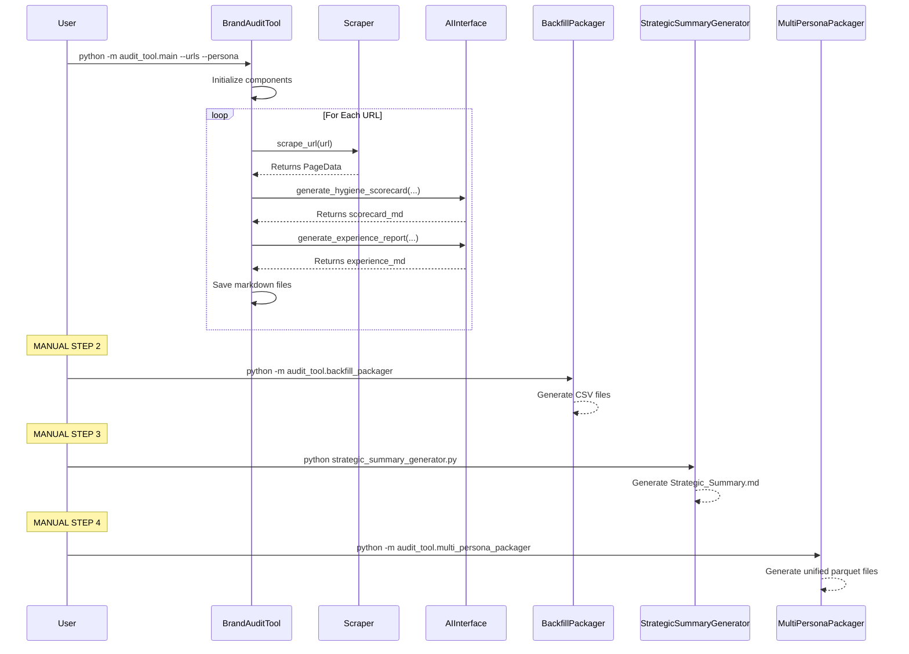

# Functional Specification: Persona Experience & Brand Audit Tool

**Status: ✅ FUNCTIONAL - Core Pipeline Operational**

**Current Reality:** Manual 4-stage process with all components working. Dashboard fully operational.
**Latest Enhancement:** Fixed data pipeline issues, standardized schema, eliminated column mismatches.

## 1. Overview

This document provides a functional specification for the Persona Experience & Brand Audit Tool. It describes the system's behavior, features, and component interactions.

The system is a Python command-line application that audits a list of URLs from the perspective of a defined persona. For a given persona, it produces:

1.  A **Persona Experience Report** for each URL.
2.  A **Brand Hygiene Scorecard** for each URL.
3.  A single, consolidated **Strategic Summary** report that aggregates findings from all audited URLs.

### 1.1. High-Level Architecture

The application follows a modular, 4-stage design with manual orchestration between stages.

- **Technology Stack:** Python 3.10+, Requests, BeautifulSoup4, Anthropic SDK, OpenAI SDK, PyYAML, Pandas.
- **Current Execution Flow (Manual 4-Stage Process):**
  1.  **Stage 1 - Audit Generation:** `python -m audit_tool.main` generates markdown scorecards and experience reports.
  2.  **Stage 2 - Data Enhancement:** `python -m audit_tool.backfill_packager` converts markdown to structured CSV files.
  3.  **Stage 3 - Strategic Summary:** `python strategic_summary_generator.py` creates executive-level insights.
  4.  **Stage 4 - Data Unification:** `python -m audit_tool.multi_persona_packager` generates unified parquet files for dashboard.

### 1.2. Current Limitations

- **Manual Process:** Requires 4 separate command executions
- **No Automation:** Each stage must be run manually in sequence
- **Error Handling:** No automated recovery between stages
- **Progress Tracking:** No visibility into pipeline execution status

## 2. Component Specification

### 2.1. Main Orchestrator (`main.py`)

- **Purpose:** Entry point and controller of the application via `BrandAuditTool` class.
- **Interface:** Accepts command-line arguments: `python -m audit_tool.main --urls <path> --persona <path> --output <path> --model <provider>`.
- **Logic:**
  1.  Parses arguments and initializes `BrandAuditTool`.
  2.  Initializes components (`Scraper`, `AIInterface`, `MethodologyParser`, `PersonaParser`).
  3.  Loads persona and creates output directory.
  4.  Loops through URLs: scrapes content, generates hygiene scorecard and experience report via `AIInterface`.
  5.  Saves markdown reports to persona-specific directory.
  6.  Generates strategic summary using `StrategicSummaryGenerator`.

### 2.2. Scraper Module (`scraper.py`)

- **Purpose:** To fetch web content with caching support.
- **Functions:**
  - `scrape_url(url: str) -> PageData`:
    - Uses `requests` and `BeautifulSoup` to extract page content.
    - Implements file-based caching to improve performance.
    - Handles 404s and technical issues gracefully.
    - Returns a `PageData` object containing URL, raw text, and metadata.

### 2.3. AI Module (`ai_interface.py`)

- **Purpose:** To abstract all interactions with multiple AI providers (Anthropic Claude, OpenAI).
- **Functions:**
  - `generate_hygiene_scorecard(url: str, page_content: str, persona_content: str, methodology: Any) -> str`:
    - Constructs methodology-specific prompts for hygiene scorecard generation.
    - Supports both Anthropic and OpenAI providers.
    - Returns the generated Markdown scorecard as a string.
  - `generate_experience_report(url: str, page_content: str, persona_content: str, methodology: Any) -> str`:
    - Constructs persona-specific prompts for experience report generation.
    - Uses provider-specific prompt formatting.
    - Returns the generated Markdown narrative as a string.
  - `generate_strategic_summary(persona_name: str, scorecard_data: List[Dict], methodology: Any) -> str`:
    - Takes aggregated scorecard data and generates executive-level insights.
    - Integrates with methodology configuration for consistent analysis.
    - Returns comprehensive strategic summary as Markdown.

### 2.4. Generators Module (`generators.py`)

- **Purpose:** To create structured markdown reports from audit data.
- **Classes:**
  - `HygieneScorecard`: Generates hygiene scorecards in markdown format with criteria scores, evidence, and recommendations.
  - `ExperienceReport`: Generates experience reports with persona-specific insights, sentiment metrics, and recommendations.
  - `StrategicSummary`: Generates strategic summaries with executive insights, key findings, and actionable recommendations.
- **Functions:**
  - `parse_ai_scorecard(markdown: str) -> Dict[str, Any]`: Parses AI-generated scorecard markdown into structured data.
  - `parse_ai_experience_report(markdown: str) -> Dict[str, Any]`: Parses AI-generated experience reports into structured data.

### 2.5. Reporting Module (`reporter.py`)

- **Purpose:** To write generated reports to markdown files using templates.
- **Functions:**
  - `save_report(content: str, filepath: str)`: Saves content to specified file path.
  - Template-based rendering for consistent report formatting.

### 2.6. Additional Core Modules

#### MethodologyParser (`methodology_parser.py`)

- **Purpose:** Loads and parses YAML methodology configuration.
- **Functions:**
  - `parse() -> Methodology`: Converts YAML config into structured Python objects.
  - `get_tier_criteria(tier_name: str)`: Returns criteria for specific tier.

#### PersonaParser (`persona_parser.py`)

- **Purpose:** Extracts persona attributes from markdown files.
- **Functions:**
  - `extract_attributes_from_content(content: str) -> Persona`: Parses persona definitions.

#### TierClassifier (`tier_classifier.py`)

- **Purpose:** Classifies URLs into appropriate tiers using regex patterns.
- **Functions:**
  - `classify_url(url: str) -> Tuple[str, Dict]`: Determines tier and configuration.

#### EnhancedBackfillPackager (`backfill_packager.py`)

- **Purpose:** Processes markdown reports into structured CSV data.
- **Functions:**
  - `process_persona(persona_name: str)`: Generates enhanced CSV files from markdown.

#### StrategicSummaryGenerator (`strategic_summary_generator.py`)

- **Purpose:** Creates executive-level strategic summaries.
- **Functions:**
  - `generate_full_report() -> Tuple[str, List, Dict]`: Aggregates data and generates insights.

#### MultiPersonaPackager (`multi_persona_packager.py`)

- **Purpose:** Unifies data across multiple personas for dashboard consumption.
- **Functions:**
  - `process_all_personas()`: Creates unified parquet files for cross-persona analysis.

## 3. Data Flow Diagram

### Current Implementation (Manual 4-Stage Process)

## 4. Error Handling

- **Network Errors:** The `scraper.py` module handles basic errors, but the primary resilience comes from its cache-first approach during development.
- **AI API Errors:** The `ai_interface.py` module implements a retry mechanism for transient API failures.
- **Parsing Errors:** The `SummaryGenerator` includes a robust JSON cleaning function (`_extract_json_from_response`) and a `try-except` block to prevent crashes from malformed AI responses, ensuring the program can complete even if the final qualitative summary fails.

## 5. Strategic Summary Generation Functional Requirements

The summary generation process fulfills the following requirements:

- **FS-5.1:** The system shall generate a single, consolidated strategic summary report after all individual URL audits for a persona are complete.
- **FS-5.2 (Quantitative):** The system parses all generated `_hygiene_scorecard.md` files to aggregate scores, calculate averages for each tier, and identify top/bottom performing pages.
- **FS-5.3 (Qualitative):** The system concatenates all `_experience_report.md` files and uses the `AIInterface` to perform a thematic analysis, generating an executive summary, key strengths, and key weaknesses.
- **FS-5.4 (Reporting):** The system uses a Jinja2 template (`summary_template.md`) to format the aggregated quantitative and qualitative data into a final `Strategic_Summary.md` file.

## 6. Enhanced UX Requirements (Phase 2)

### 6.1 Executive Dashboard Requirements

- **FS-6.1 (Executive Landing):** The system shall provide a story-driven executive dashboard as the default landing experience with brand health score, AI-generated summary, and top 3 wins/risks.
- **FS-6.2 (Derived Metrics):** The system shall calculate and display enhanced metrics including brand_health_index, impact_score, trust_gap, and quick_win_flag across all data outputs.
- **FS-6.3 (Progressive Disclosure):** The system shall implement progressive disclosure with 5 focused sections: Executive Dashboard → Persona Storyboards → Action Roadmap → Evidence Explorer → System Settings.
- **FS-6.4 (Action Orientation):** The system shall provide actionable insights with owner assignment, target dates, and progress tracking for all recommendations.

### 6.2 Enhanced Data Model Requirements

- **FS-6.5 (Brand Health Index):** The system shall calculate a composite brand health index using the formula: hygiene*score * 0.60 + positive*sentiment_pct * 0.25 + engagement_rate \* 0.15.
- **FS-6.6 (Impact Scoring):** The system shall calculate impact scores for all criteria and recommendations using severity × frequency × business_value methodology.
- **FS-6.7 (Quick Win Identification):** The system shall automatically flag recommendations as quick wins when complexity ≤ 2 AND impact_score ≥ 7.0.
- **FS-6.8 (Trust Gap Analysis):** The system shall calculate trust gaps based on trust-related criteria performance: (10 - average_trust_score) / 10.

### 6.3 User Experience Requirements

- **FS-6.9 (Time to Insight):** The executive dashboard shall enable understanding of brand health, persona sentiment, and priority actions within 60 seconds.
- **FS-6.10 (Visual Hierarchy):** The system shall implement card-based design with hero metrics, insight cards, and progressive detail disclosure.
- **FS-6.11 (Color Psychology):** The system shall use consistent color coding: Green (success/positive), Amber (caution/mixed), Red (risk/negative), Blue (information), Purple (AI insights).
- **FS-6.12 (Responsive Design):** The dashboard shall adapt to different screen sizes and maintain usability across desktop and tablet devices.
