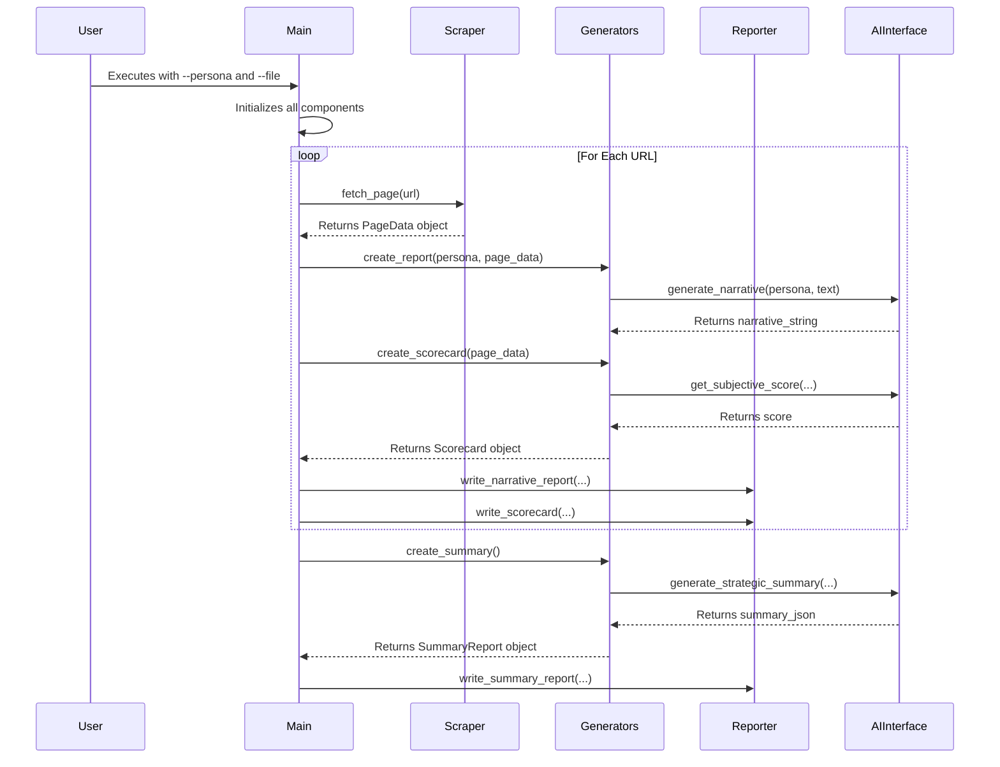

# Functional Specification: Persona Experience & Brand Audit Tool

**Status: ✅ ENHANCED - UX Strategy Implementation Complete**

**Latest Enhancement:** Executive Dashboard with story-driven UX implementing comprehensive data pipeline transformation.

## 1. Overview

This document provides a functional specification for the Persona Experience & Brand Audit Tool. It describes the system's behavior, features, and component interactions.

The system is a Python command-line application that audits a list of URLs from the perspective of a defined persona. For a given persona, it produces:

1.  A **Persona Experience Report** for each URL.
2.  A **Brand Hygiene Scorecard** for each URL.
3.  A single, consolidated **Strategic Summary** report that aggregates findings from all audited URLs.

### 1.1. High-Level Architecture

The application follows a modular, orchestrated design. A central `main.py` script coordinates the work of specialized modules for scraping, analysis, scoring, and reporting in a clear, linear flow.

- **Technology Stack:** Python 3.10+, Requests, BeautifulSoup4, Anthropic SDK, Jinja2, PyYAML.
- **Execution Flow:**
  1.  Initialize with a persona file and a file containing a list of URLs.
  2.  Load the scoring `Methodology` from YAML configuration.
  3.  **Loop through URLs:** For each URL:
      a. **Scrape:** Collect page content with caching.
      b. **Generate Narrative:** Create the persona-driven qualitative report using configurable templates.
      c. **Generate Scorecard:** Create the quantitative scorecard based on YAML methodology.
      d. **Write Reports:** Save the two generated reports to disk.
  4.  **Summarize:** After the loop, aggregate all generated reports to produce and save a final `Strategic_Summary.md`.

## 2. Component Specification

### 2.1. Main Orchestrator (`main.py`)

- **Purpose:** Entry point and controller of the application.
- **Interface:** Accepts command-line arguments: `python -m audit_tool.main --persona <path> --file <path>`.
- **Logic:**
  1.  Parses arguments.
  2.  Initializes all necessary components (`Scraper`, `AIInterface`, `MethodologyParser`, `NarrativeGenerator`, `ScorecardGenerator`, `SummaryGenerator`, `Reporter`).
  3.  Loops through the URLs provided in the file. Inside the loop, it calls the appropriate generators and reporter methods for each URL.
  4.  After the loop, it calls the `SummaryGenerator` and `Reporter` to create the final summary.

### 2.2. Scraper Module (`scraper.py`)

- **Purpose:** To fetch web content.
- **Functions:**
  - `fetch_page(url: str) -> PageData`:
    - Uses `requests` and `BeautifulSoup` to get page content.
    - Implements a simple file-based cache to speed up development.
    - Returns a `PageData` object containing the URL and raw text content.

### 2.3. AI Module (`ai_interface.py`)

- **Purpose:** To abstract all interactions with the Anthropic LLM API.
- **Functions:**
  - `generate_narrative(persona_content: str, page_text: str) -> str`:
    - Constructs a detailed prompt instructing the AI to adopt the specified persona and analyze the provided text from that point of view.
    - Returns the generated Markdown narrative as a string.
  - `get_subjective_score(criterion_name: str, page_text: str) -> float`:
    - Constructs a highly-constrained prompt asking for a single numerical score (0.0-10.0) for a given criterion.
    - Returns a single float.
  - `generate_strategic_summary(compiled_text: str) -> str`:
    - Takes the concatenated text of all narrative reports for a persona.
    - Asks the AI to perform a thematic analysis and return a raw, valid JSON object containing an `executive_summary`, `key_strengths`, and `key_weaknesses`.

### 2.4. Generators Module (`generators.py`)

- **Purpose:** To create the content for all reports.
- **Classes:**
  - `NarrativeGenerator`: A lightweight wrapper that calls `ai_interface.generate_narrative`.
  - `ScorecardGenerator`: Classifies the page (e.g., Onsite Tier 1), then iterates through the relevant criteria from the methodology, calling `ai_interface.get_subjective_score` for each. It calculates a final weighted score and returns a structured `Scorecard` object.
  - `SummaryGenerator`: Orchestrates the final summary. It has private methods to parse all generated scorecards and narrative reports from the filesystem. It calls `ai_interface.generate_strategic_summary` to get the qualitative analysis and then aggregates all data into a `SummaryReport` object. It includes a robust helper function to parse the AI's JSON output.

### 2.5. Reporting Module (`reporter.py`)

- **Purpose:** To write the generated report objects to markdown files using Jinja2 templates.
- **Functions:**
  - `write_narrative_report(...)`: Writes the narrative string to a `.md` file.
  - `write_scorecard(...)`: Renders a `Scorecard` object using the `scorecard_template.md`.
  - `write_summary_report(...)`: Renders a `SummaryReport` object using the `summary_template.md`.

## 3. Data Flow Diagram

## 4. Error Handling

- **Network Errors:** The `scraper.py` module handles basic errors, but the primary resilience comes from its cache-first approach during development.
- **AI API Errors:** The `ai_interface.py` module implements a retry mechanism for transient API failures.
- **Parsing Errors:** The `SummaryGenerator` includes a robust JSON cleaning function (`_extract_json_from_response`) and a `try-except` block to prevent crashes from malformed AI responses, ensuring the program can complete even if the final qualitative summary fails.

## 5. Strategic Summary Generation Functional Requirements

The summary generation process fulfills the following requirements:

- **FS-5.1:** The system shall generate a single, consolidated strategic summary report after all individual URL audits for a persona are complete.
- **FS-5.2 (Quantitative):** The system parses all generated `_hygiene_scorecard.md` files to aggregate scores, calculate averages for each tier, and identify top/bottom performing pages.
- **FS-5.3 (Qualitative):** The system concatenates all `_experience_report.md` files and uses the `AIInterface` to perform a thematic analysis, generating an executive summary, key strengths, and key weaknesses.
- **FS-5.4 (Reporting):** The system uses a Jinja2 template (`summary_template.md`) to format the aggregated quantitative and qualitative data into a final `Strategic_Summary.md` file.

## 6. Enhanced UX Requirements (Phase 2)

### 6.1 Executive Dashboard Requirements

- **FS-6.1 (Executive Landing):** The system shall provide a story-driven executive dashboard as the default landing experience with brand health score, AI-generated summary, and top 3 wins/risks.
- **FS-6.2 (Derived Metrics):** The system shall calculate and display enhanced metrics including brand_health_index, impact_score, trust_gap, and quick_win_flag across all data outputs.
- **FS-6.3 (Progressive Disclosure):** The system shall implement progressive disclosure with 5 focused sections: Executive Dashboard → Persona Storyboards → Action Roadmap → Evidence Explorer → System Settings.
- **FS-6.4 (Action Orientation):** The system shall provide actionable insights with owner assignment, target dates, and progress tracking for all recommendations.

### 6.2 Enhanced Data Model Requirements

- **FS-6.5 (Brand Health Index):** The system shall calculate a composite brand health index using the formula: hygiene*score * 0.60 + positive*sentiment_pct * 0.25 + engagement_rate \* 0.15.
- **FS-6.6 (Impact Scoring):** The system shall calculate impact scores for all criteria and recommendations using severity × frequency × business_value methodology.
- **FS-6.7 (Quick Win Identification):** The system shall automatically flag recommendations as quick wins when complexity ≤ 2 AND impact_score ≥ 7.0.
- **FS-6.8 (Trust Gap Analysis):** The system shall calculate trust gaps based on trust-related criteria performance: (10 - average_trust_score) / 10.

### 6.3 User Experience Requirements

- **FS-6.9 (Time to Insight):** The executive dashboard shall enable understanding of brand health, persona sentiment, and priority actions within 60 seconds.
- **FS-6.10 (Visual Hierarchy):** The system shall implement card-based design with hero metrics, insight cards, and progressive detail disclosure.
- **FS-6.11 (Color Psychology):** The system shall use consistent color coding: Green (success/positive), Amber (caution/mixed), Red (risk/negative), Blue (information), Purple (AI insights).
- **FS-6.12 (Responsive Design):** The dashboard shall adapt to different screen sizes and maintain usability across desktop and tablet devices.
