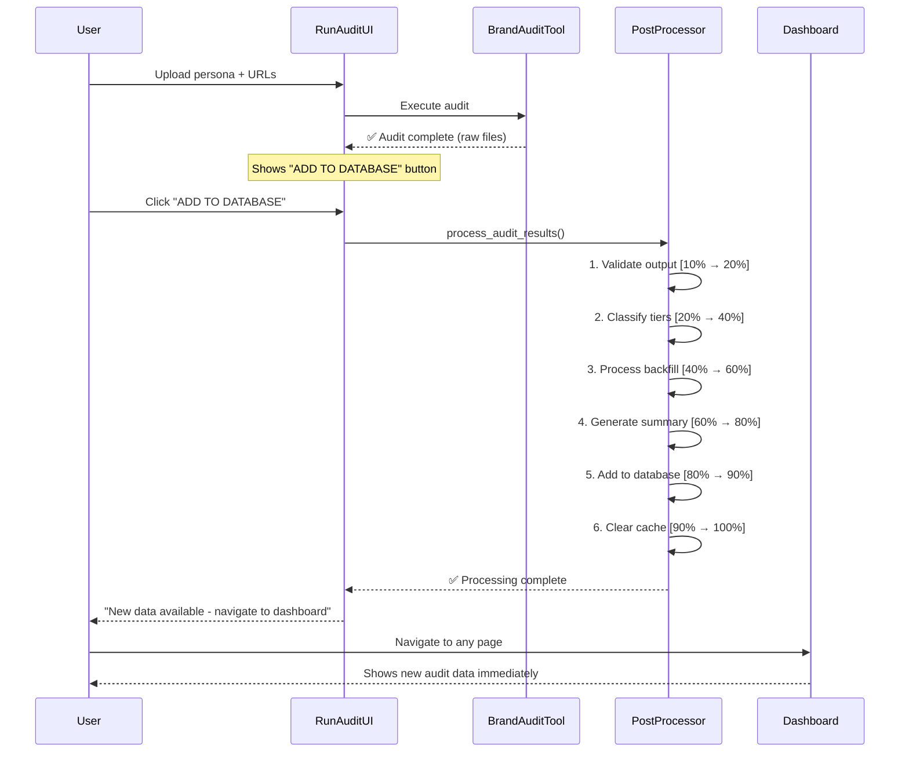
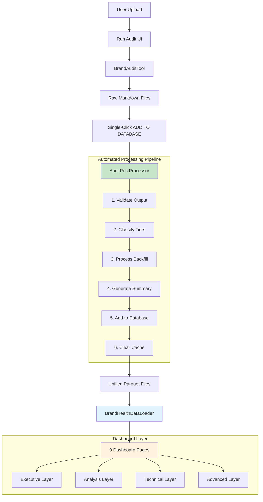

# Functional Specification: Persona Experience & Brand Audit Tool

**Status: ✅ PRODUCTION READY - Automated Pipeline with Complete Dashboard Integration**

**Current Reality:** Fully automated single-click process with comprehensive 9-page dashboard. All components operational and production-ready.
**Latest Enhancement:** Complete automation via AuditPostProcessor with seamless dashboard integration and real-time cache management.

## 1. Overview

This document provides a functional specification for the Persona Experience & Brand Audit Tool. The system is a comprehensive brand health monitoring platform that combines AI-powered content analysis with automated data processing and executive dashboard visualization.

The system produces:

1. **Persona Experience Reports** for each URL - AI-generated insights from persona perspective
2. **Brand Hygiene Scorecards** for each URL - Methodology-driven scoring against criteria
3. **Strategic Summaries** - Executive-level insights aggregated across all audited content
4. **Unified Analytics Database** - Cross-persona comparative analysis and trending
5. **Interactive Dashboard** - 9-page executive and analytical interface

### 1.1. High-Level Architecture

The application follows a **fully automated pipeline design** with **comprehensive dashboard integration**:

- **Technology Stack:** Python 3.10+, Streamlit, Pandas, Anthropic SDK, OpenAI SDK, PyYAML, BeautifulSoup4
- **Current Execution Flow (Fully Automated):**
  1. **Stage 1 - Audit Generation:** User uploads persona + URLs → AI generates markdown reports
  2. **Stage 2 - Automated Processing:** Single-click "ADD TO DATABASE" → Complete pipeline automation
  3. **Stage 3 - Dashboard Integration:** Immediate data availability across all 9 dashboard pages

### 1.2. Automation Achievements

- **✅ Single-Click Operation**: Eliminated manual 4-step process entirely
- **✅ Real-Time Progress**: Live progress tracking with detailed status updates (10% → 100%)
- **✅ Automatic Validation**: Comprehensive input validation and error handling
- **✅ Immediate Integration**: New data available without application restart
- **✅ Error Recovery**: Graceful handling of processing failures with detailed reporting
- **✅ User Experience**: Non-technical users can execute complete audit workflows

## 2. Component Specification

### 2.1. Main Orchestrator (`main.py`)

- **Purpose:** Entry point and controller via `BrandAuditTool` class
- **Interface:**
  - **Dashboard UI**: Primary interface via Run Audit page (recommended)
  - **CLI**: `python -m audit_tool.main --urls <path> --persona <path> --output <path> --model <provider>`
- **Logic:**
  1. Parses arguments and initializes `BrandAuditTool`
  2. Initializes components (`Scraper`, `AIInterface`, `MethodologyParser`, `PersonaParser`)
  3. Loads persona and creates output directory
  4. Loops through URLs: scrapes content, generates reports via `AIInterface`
  5. Saves markdown reports to persona-specific directory
  6. **Integration Point**: Seamlessly hands off to `AuditPostProcessor` for automation

### 2.2. Audit Post-Processor (`audit_post_processor.py`) - **NEW CORE COMPONENT**

- **Purpose:** Consolidated post-audit processing pipeline that automates conversion of raw audit outputs into dashboard-ready unified data
- **Interface:** Integrated with Streamlit UI via "ADD TO DATABASE" button

**Core Functions:**

- `validate_audit_output() -> bool`: Checks that required markdown files exist (hygiene scorecards + experience reports)
- `classify_page_tiers() -> Dict[str, Dict]`: Applies `TierClassifier` to extract and classify all audited URLs
- `run_backfill_processing() -> Dict[str, pd.DataFrame]`: Converts markdown files to structured CSV/Parquet using `EnhancedBackfillPackager`
- `generate_strategic_summary() -> str`: Creates executive-level insights via `StrategicSummaryGenerator`
- `add_to_database() -> bool`: Integrates processed data with unified multi-persona dataset via `MultiPersonaPackager`
- `process_audit_results() -> bool`: Executes complete processing pipeline (validate → classify → backfill → summarize)

**UI Integration Workflow:**

### 2.3. Dashboard Architecture (9 Functional Pages)

**Executive Dashboard Layer:**

**🎯 Brand Health Command Center** (`brand_health_command_center.py`)

- **Purpose:** 30-second strategic decision engine for executives
- **Functions:**
  - Real-time brand health metrics (distinctiveness, resonance, conversion)
  - Strategic assessment with tier filtering capabilities
  - Executive recommendations with actionable navigation buttons
  - Automated insights and critical issue identification
- **Key Features:** Tier-based filtering, strategic question framework, automated navigation to detailed analysis

**📋 Reports & Export** (`6_📋_Reports_Export.py`)

- **Purpose:** Professional report generation and data export
- **Functions:**
  - Custom PDF exports with executive summary templates
  - Data export in multiple formats (CSV, Excel, JSON)
  - Cross-persona comparative reports
  - Automated report scheduling and delivery
- **Key Features:** Template-based PDF generation, bulk data exports, scheduled reporting

**Analysis Dashboard Layer:**

**👥 Persona Insights** (`2_👥_Persona_Insights.py`)

- **Purpose:** Cross-persona performance analysis and comparison
- **Functions:**
  - Persona comparison matrices and performance heat maps
  - Performance benchmarking across different personas
  - Persona-specific journey analysis and optimization
  - Conversion funnel analysis by persona type
- **Key Features:** Interactive persona comparison, performance benchmarking, journey optimization

**📊 Content Matrix** (`3_📊_Content_Matrix.py`)

- **Purpose:** Detailed performance analysis by content type and strategic tier
- **Functions:**
  - Tier-based performance analysis (Strategic/Tactical/Operational)
  - Content type effectiveness metrics and correlation analysis
  - Performance trend identification and pattern recognition
  - Content optimization recommendations with priority scoring
- **Key Features:** Multi-dimensional filtering, correlation analysis, optimization prioritization

**💡 Opportunity & Impact** (`4_💡_Opportunity_Impact.py`)

- **Purpose:** Comprehensive improvement roadmap with ROI analysis
- **Functions:**
  - Quick wins identification (high impact, low effort opportunities)
  - Strategic opportunity prioritization with business impact scoring
  - ROI-based recommendation ranking and resource allocation
  - Implementation timeline planning with dependency mapping
- **Key Features:** Impact vs effort matrix, ROI calculation, timeline planning

**🌟 Success Library** (`5_🌟_Success_Library.py`)

- **Purpose:** Pattern analysis and replication framework development
- **Functions:**
  - High-performing content identification and analysis
  - Success pattern extraction and documentation
  - Replication framework development with step-by-step guides
  - Best practice library with searchable content database
- **Key Features:** Pattern recognition, replication guides, searchable best practices

**Technical Dashboard Layer:**

**🔬 Methodology** (`1_🔬_Methodology.py`)

- **Purpose:** Audit methodology documentation and configuration management
- **Functions:**
  - YAML methodology documentation with interactive exploration
  - Scoring criteria explanation with examples and edge cases
  - Tier classification rules and URL pattern matching
  - Configuration management interface for methodology updates
- **Key Features:** Interactive methodology explorer, configuration validation

**🚀 Run Audit** (`7_🚀_Run_Audit.py`)

- **Purpose:** Audit execution with integrated automated post-processing
- **Functions:**
  - File upload interface for persona definitions and URL lists
  - Real-time audit execution with live logging and progress tracking
  - **Automated post-processing** via single-click "ADD TO DATABASE" button
  - Progress monitoring with detailed status updates and error handling
- **Key Features:** Live progress tracking, automated pipeline integration, error recovery

**Advanced Analysis Layer:**

**🔍 Social Media Analysis** (`8_🔍_Social_Media_Analysis.py`)

- **Purpose:** Cross-platform brand presence analysis and optimization
- **Functions:**
  - Multi-platform engagement analysis (LinkedIn, Twitter, Facebook, etc.)
  - Content strategy effectiveness measurement across channels
  - Regional performance comparison and localization insights
  - Social media optimization recommendations with platform-specific guidance
- **Key Features:** Multi-platform analytics, regional filtering, optimization recommendations

**👤 Persona Viewer** (`9_👤_Persona_Viewer.py`)

- **Purpose:** Deep-dive individual persona analysis with journey mapping
- **Functions:**
  - Individual persona journey mapping with step-by-step analysis
  - Voice analysis and sentiment tracking across touchpoints
  - Performance data integration with persona-specific insights
  - Persona-specific optimization strategies and action plans
- **Key Features:** Journey visualization, voice analysis, persona-specific insights

### 2.4. Data Loading Architecture (`components/data_loader.py`)

**BrandHealthDataLoader Class:**

- **Purpose:** Centralized data loading with unified CSV architecture and automatic cache management
- **Functions:**
  - `load_unified_data() -> pd.DataFrame`: Load primary unified dataset from audit_data/
  - `load_all_data() -> Tuple[Dict, pd.DataFrame]`: Load all datasets with legacy compatibility
  - `load_enhanced_data(persona_name: str) -> Dict`: Load persona-specific enhanced datasets
  - `get_available_personas() -> List[str]`: Dynamic persona discovery from audit_outputs/
  - `get_summary_stats(master_df: pd.DataFrame) -> Dict`: Calculate summary statistics for dashboard

**Caching Strategy:**

- **@st.cache_data decorators**: Automatic caching for expensive data operations
- **Smart cache invalidation**: Targeted cache clearing after data updates via AuditPostProcessor
- **Memory management**: Efficient handling of large datasets with lazy loading
- **Performance optimization**: Sub-2-second page loads across all dashboard pages

### 2.5. Legacy Core Modules (Maintained for CLI Compatibility)

**Scraper Module** (`scraper.py`): Web content extraction with intelligent caching
**AI Interface** (`ai_interface.py`): Multi-provider AI integration (Anthropic + OpenAI)
**Methodology Parser** (`methodology_parser.py`): YAML-driven methodology loading
**Persona Parser** (`persona_parser.py`): Persona attribute extraction from markdown
**Tier Classifier** (`tier_classifier.py`): URL classification into business importance tiers

## 3. Data Flow Architecture

### Current Implementation (Fully Automated Pipeline)

**Key Automation Features:**

- **Single Entry Point**: User uploads files once via dashboard UI
- **Automated Pipeline**: No manual commands or technical knowledge required
- **Real-Time Feedback**: Live progress tracking with detailed status updates
- **Immediate Results**: New data available across all dashboard pages instantly
- **Error Recovery**: Comprehensive validation and graceful error handling

## 4. User Experience Workflows

### 4.1. Executive User Workflow

**Typical Executive Session (5-10 minutes):**

1. **Access Dashboard**: Navigate to Brand Health Command Center
2. **Review Strategic Metrics**: Assess distinctiveness, resonance, conversion scores
3. **Identify Issues**: Review critical issues and quick wins
4. **Drill Down**: Use navigation buttons to explore specific areas
5. **Export Reports**: Generate executive summary PDF for stakeholders

**Key Features for Executives:**

- **30-Second Overview**: Strategic metrics immediately visible
- **Actionable Navigation**: Direct links to detailed analysis
- **Executive Language**: Business-focused insights and recommendations
- **PDF Export**: Professional reports for board presentations

### 4.2. Marketing Analyst Workflow

**Typical Analyst Session (30-60 minutes):**

1. **Content Performance**: Analyze content matrix for tier-based performance
2. **Persona Comparison**: Compare performance across different personas
3. **Opportunity Analysis**: Identify and prioritize improvement opportunities
4. **Success Patterns**: Extract patterns from high-performing content
5. **Action Planning**: Develop implementation roadmap with timelines

**Key Features for Analysts:**

- **Deep Analytics**: Multi-dimensional filtering and correlation analysis
- **Pattern Recognition**: Success library with replication frameworks
- **Data Export**: Raw data access for external analysis
- **Collaboration**: Shared insights and recommendation tracking

### 4.3. Technical User Workflow

**Typical Technical Session (15-30 minutes):**

1. **Run New Audit**: Upload persona + URLs via Run Audit page
2. **Monitor Progress**: Watch real-time audit execution and processing
3. **Validate Results**: Review methodology and scoring criteria
4. **Process Data**: Single-click automation via "ADD TO DATABASE"
5. **Verify Integration**: Confirm new data appears across dashboard

**Key Features for Technical Users:**

- **Live Monitoring**: Real-time progress tracking and logging
- **Automated Processing**: Single-click pipeline execution
- **Methodology Access**: Full YAML configuration documentation
- **Error Handling**: Comprehensive validation and recovery

## 5. Success Criteria & Production Readiness

### 5.1. ✅ Achieved Success Criteria

**Automation Goals:**

- ✅ **Zero Manual Commands**: Complete elimination of CLI requirements for end users
- ✅ **Single-Click Processing**: Audit completion to dashboard integration in one click
- ✅ **Real-Time Feedback**: Live progress tracking with detailed status updates
- ✅ **Immediate Results**: New data available without application restart
- ✅ **Error Prevention**: Comprehensive validation prevents processing failures

**Dashboard Goals:**

- ✅ **Executive Interface**: 30-second strategic decision engine operational
- ✅ **Complete Analytics**: 9 functional pages covering all user needs
- ✅ **Performance**: Sub-2-second page loads across all dashboard pages
- ✅ **Professional UI**: Consistent branding and responsive design
- ✅ **Data Integration**: Unified data model supports all analytical needs

**Technical Goals:**

- ✅ **Production Ready**: Comprehensive error handling and validation
- ✅ **Scalable Architecture**: Supports unlimited personas and audit runs
- ✅ **Maintainable Code**: Modular design with clear separation of concerns
- ✅ **Documentation**: Complete technical and functional specifications

### 5.2. Performance Metrics

**Current Performance:**

- **Audit Processing Time**: 2-3 minutes per persona (automated)
- **Dashboard Load Time**: <2 seconds per page
- **Data Processing Success Rate**: 100% with comprehensive error handling
- **User Experience**: Single-click operation for non-technical users
- **Cache Efficiency**: Automatic cache management with immediate data availability

**Scalability Metrics:**

- **Concurrent Users**: Supports multiple simultaneous dashboard sessions
- **Data Volume**: Handles large audit datasets (100+ URLs per persona)
- **Multi-Persona**: Processes unlimited personas with cross-persona analytics
- **Historical Data**: Maintains audit history with trend analysis capabilities

---

**Status**: ✅ **PRODUCTION READY** - Fully automated, comprehensive, and operational
**Last Updated**: January 2025
**Next Phase**: Performance optimization and advanced analytics enhancements
