# Dashboard Rationalization Plan

**Status:** 🚨 URGENT - Action Required  
**Priority:** HIGH - Blocking user experience improvements  
**Effort:** Medium (2-3 weeks)  
**Impact:** Transform "data dump" into "strategic command center"

---

## 🔍 **AUDIT FINDINGS SUMMARY**

### **Current State: 12 Scattered Pages**

- **Main Dashboard** + **11 separate pages** with significant overlap
- **No clear user journey** or logical progression
- **Major duplicates** in core functionality
- **Technical focus** instead of business decision support

### **Target State: 6 Strategic Tabs**

- **Clear question-answer flow** aligned with UX specification
- **Eliminate redundancies** and consolidate related functionality
- **Business-focused narrative** for executive decision making

---

## 🚨 **CRITICAL DUPLICATES IDENTIFIED**

### **1. MAJOR OVERLAP: Executive Summary vs Main Dashboard**

**Problem:** Both pages serve identical purpose

- ✅ Brand Health Score metrics
- ✅ Critical Issues alerts
- ✅ Strategic Assessment (distinct/resonating/converting)
- ✅ Top Opportunities identification
- ✅ Success Stories highlighting

**Action:** Merge Executive Summary into Main Dashboard

### **2. PERFORMANCE ANALYSIS OVERLAP: Overview vs Executive Summary**

**Problem:** Redundant performance analysis

- ✅ Performance by Tier tables
- ✅ Key Metrics displays
- ✅ Critical Issues identification

**Action:** Merge Overview into Content Matrix tab

### **3. PERSONA ANALYSIS OVERLAP: Persona Comparison vs Persona Experience**

**Problem:** Split persona functionality

- ✅ Persona filtering capabilities
- ✅ Experience metrics (sentiment/engagement)
- ✅ Performance comparison charts

**Action:** Consolidate into single Persona Insights tab

### **4. CRITERIA ANALYSIS OVERLAP: Overview vs Criteria Deep Dive**

**Problem:** Duplicate criteria analysis

- ✅ Criteria performance tables
- ✅ Best/worst examples identification

**Action:** Merge Criteria Deep Dive into Opportunity & Impact tab

---

## 🎯 **RATIONALIZATION STRATEGY**

### **Phase 1: 6-Tab Consolidation (12 → 6)**

| **New Tab**                 | **Consolidate These Pages**                | **Primary Question**                            | **Key Elements**                                                                                                                                   |
| --------------------------- | ------------------------------------------ | ----------------------------------------------- | -------------------------------------------------------------------------------------------------------------------------------------------------- |
| **🎯 Executive Dashboard**  | Main Dashboard + Executive Summary         | "How healthy is the brand right now?"           | **EXECUTIVE SUMMARY ONLY:** Brand health score, critical alerts, quick wins, top 3 opportunities, top 3 success stories, strategic recommendations |
| **👥 Persona Insights**     | Persona Comparison + Persona Experience    | "How do our personas feel and act?"             | Persona filtering, persona cards, sentiment/engagement bars, cross-persona comparison, first impression quotes                                     |
| **📊 Content Matrix**       | Overview + Tier Analysis                   | "Where do we pass/fail across content types?"   | **DETAILED ANALYSIS:** Tier performance tables, interactive heatmap, drill-down to page lists, content type analysis                               |
| **💡 Opportunity & Impact** | AI Strategic Insights + Criteria Deep Dive | "Which gaps matter most and what should we do?" | **BEYOND TOP 3:** Detailed opportunity analysis, impact waterfall, AI action recommendations, criteria deep-dive                                   |
| **🌟 Success Library**      | Page Performance + Evidence Explorer       | "What already works that we can emulate?"       | **BEYOND TOP 3:** Detailed success analysis, evidence browser, pattern analysis, copy examples                                                     |
| **📋 Reports & Export**     | Detailed Data + Run Audit                  | "How do I analyze data and run new audits?"     | **RAW DATA:** Data tables, multi-format exports, custom reports, audit runner                                                                      |

### **Phase 2: Content Distribution Strategy**

#### **🎯 MAIN PAGE: EXECUTIVE SUMMARY FOCUS**

**PHILOSOPHY:** Answer 5 key questions in 30 seconds for executive decision-making

**KEEP IN MAIN PAGE:**

- ✅ **Brand Health Score** (hero metric 0-10)
- ✅ **Critical Issues Alert** (pages < 4.0 score)
- ✅ **Quick Wins Count** (immediate opportunities)
- ✅ **Success Pages Count** (high performers ≥ 7.7)
- ✅ **Three Strategic Questions:** Are we distinct/resonating/converting?
- ✅ **Top 3 Improvement Opportunities** (with impact scores)
- ✅ **Top 3 Success Stories** (what's working)
- ✅ **Strategic Recommendations** (AI-generated)
- ✅ **Navigation guidance** to specialized tabs

**REMOVE FROM MAIN PAGE:**

- ❌ **Detailed tier performance tables** → Move to Content Matrix
- ❌ **Persona filtering dropdown** → Move to Persona Insights
- ❌ **Detailed evidence exploration** → Move to Success Library
- ❌ **Raw data tables** → Move to Reports & Export
- ❌ **Comprehensive opportunity analysis** → Move to Opportunity & Impact
- ❌ **Detailed success story analysis** → Move to Success Library

#### **📊 SPECIALIZED TABS: DEEP-DIVE ANALYSIS**

**👥 Persona Insights:**

- Persona filtering (removed from main)
- Detailed persona performance comparison
- Sentiment/engagement analysis by persona
- First impression quotes and feedback

**📊 Content Matrix:**

- Detailed tier performance tables (removed from main)
- Interactive content type heatmaps
- Drill-down to individual page performance
- Content gap analysis

**💡 Opportunity & Impact:**

- Comprehensive opportunity analysis (beyond top 3)
- Detailed impact calculations and projections
- AI-powered action recommendations with copy examples
- Criteria-level deep-dive analysis

**🌟 Success Library:**

- Detailed success story analysis (beyond top 3)
- Evidence browser with copy examples
- Pattern analysis and success templates
- "Apply Pattern" functionality

**📋 Reports & Export:**

- Raw data exploration (removed from main)
- Multi-format export capabilities
- Custom report generation
- Audit runner integration

### **Phase 3: User Journey Flow**

```mermaid
graph TD
    A[🎯 Executive Dashboard<br/>30-second brand health check] --> B{What do I need?}

    B -->|Understand Personas| C[👥 Persona Insights<br/>How personas feel & act]
    B -->|Find Content Issues| D[📊 Content Matrix<br/>Pass/fail by content type]
    B -->|Get Action Items| E[💡 Opportunity & Impact<br/>What to do & impact]

    C --> E
    D --> E

    E --> F[🌟 Success Library<br/>What works to emulate]
    F --> G[📋 Reports & Export<br/>Share insights & run audits]

    G --> H[🚀 Run New Audit<br/>Generate fresh data]
    H --> A
```



---

## 📋 **IMPLEMENTATION PLAN**

### **Week 1: Foundation Consolidation**

#### **Day 1-2: Executive Dashboard Enhancement**

**FOCUS:** Transform main dashboard into focused 30-second executive summary

- [ ] **REMOVE detailed elements** from main dashboard:
  - [ ] Remove detailed tier performance tables → Move to Content Matrix
  - [ ] Remove persona filtering dropdown → Move to Persona Insights
  - [ ] Remove comprehensive data exploration → Move to Reports & Export
- [ ] **ENHANCE executive summary elements:**
  - [ ] Improve critical issues alerting with clear action guidance
  - [ ] Enhance top 3 opportunities display with impact scores
  - [ ] Improve top 3 success stories with key strengths
  - [ ] Add strategic recommendations prominence
- [ ] **ADD missing Executive Summary features:**
  - [ ] Enhanced brand health calculation from Executive Summary
  - [ ] Better opportunity identification algorithm
  - [ ] Improved success story selection criteria
- [ ] **ENHANCE navigation guidance** to specialized tabs

**Files to Modify:**

- `brand_health_command_center.py` (streamline and enhance)
- `1_🎯_Executive_Summary.py` (merge best features, then archive)

#### **Day 3-5: Content Matrix Creation**

- [ ] **Merge Overview charts** into new Content Matrix tab
- [ ] **Add interactive heatmap** (Page Tier × Pillar performance)
- [ ] **Implement drill-down drawer** for detailed page lists
- [ ] **Integrate tier analysis** functionality

**Files to Create/Modify:**

- `2_📊_Content_Matrix.py` (new, consolidating Overview + Tier Analysis)
- `2_📊_Overview.py` (archive)
- `6_🏗️_Tier_Analysis.py` (archive)

### **Week 2: Experience & Opportunity Consolidation**

#### **Day 1-3: Persona Insights Unification**

- [ ] **Merge Persona Comparison & Experience** into single tab
- [ ] **Create persona cards** with sentiment/engagement bars
- [ ] **Add radar chart** for pillar comparison
- [ ] **Implement quote carousel** for first impressions

**Files to Create/Modify:**

- `3_👥_Persona_Insights.py` (new, consolidating Comparison + Experience)
- `4_👥_Persona_Comparison.py` (archive)
- `5_👤_Persona_Experience.py` (archive)

#### **Day 4-5: Opportunity & Impact Integration**

- [ ] **Merge AI Strategic Insights & Criteria Deep Dive**
- [ ] **Create prioritized gap list** with impact scores
- [ ] **Add AI action drawer** with copy recommendations
- [ ] **Implement impact waterfall** visualization

**Files to Create/Modify:**

- `4_💡_Opportunity_Impact.py` (new, consolidating AI Insights + Criteria Deep Dive)
- `3_💡_AI_Strategic_Insights.py` (archive)
- `9_🎯_Criteria_Deep_Dive.py` (archive)

### **Week 3: Success Library & Export Finalization**

#### **Day 1-3: Success Library Creation**

- [ ] **Merge Page Performance & Evidence Explorer**
- [ ] **Create success cards** with pattern analysis
- [ ] **Add evidence browser** with copy-to-clipboard
- [ ] **Implement "Apply Pattern"** functionality

**Files to Create/Modify:**

- `5_🌟_Success_Library.py` (new, consolidating Page Performance + Evidence Explorer)
- `7_📄_Page_Performance.py` (archive)
- `8_🔍_Evidence_Explorer.py` (archive)

#### **Day 4-5: Reports & Export Enhancement**

- [ ] **Merge Detailed Data & Run Audit** functionality
- [ ] **Add multi-format exports** (PPT/PDF/CSV)
- [ ] **Enhance audit runner** integration
- [ ] **Create custom report builder**

**Files to Create/Modify:**

- `6_📋_Reports_Export.py` (new, consolidating Detailed Data + Run Audit)
- `10_📋_Detailed_Data.py` (integrate into new tab)
- `11_🚀_Run_Audit.py` (integrate into new tab)

---

## ⚖️ **ARCHITECTURAL PRINCIPLES & CONSTRAINTS**

### **🎯 CRITICAL PRINCIPLES TO PRESERVE**

#### **1. YAML-Driven Configuration (NON-NEGOTIABLE)**

```python
# MUST PRESERVE: All methodology comes from YAML
from audit_tool.methodology_parser import MethodologyParser
methodology = MethodologyParser.load_methodology()

# ❌ DON'T: Hardcode criteria, scoring thresholds, or business rules
# ✅ DO: Maintain dynamic methodology loading across all consolidated tabs
# ✅ DO: Preserve configurability - methodology changes should affect all tabs
```

#### **2. Persona-Centric Architecture (CORE VALUE PROP)**

```python
# MUST PRESERVE: Every analysis is persona-aware
from audit_tool.models import Persona, PageData, AuditResult
from audit_tool.multi_persona_packager import MultiPersonaPackager

# ❌ DON'T: Break persona filtering across consolidated tabs
# ❌ DON'T: Lose persona-specific scoring algorithms
# ✅ DO: Maintain cross-persona comparison capabilities
# ✅ DO: Preserve persona-specific recommendations
```

#### **3. AI-Powered Strategic Generation (DIFFERENTIATOR)**

```python
# MUST PRESERVE: AI-generated insights, not hardcoded summaries
from audit_tool.strategic_summary_generator import StrategicSummaryGenerator
from audit_tool.ai_interface import AIInterface

# ❌ DON'T: Replace AI insights with static text
# ❌ DON'T: Break Anthropic + OpenAI fallback logic
# ✅ DO: Maintain template-based generation (Jinja2)
# ✅ DO: Preserve multi-provider AI support
```

#### **4. Evidence-Based Insights (CREDIBILITY)**

```python
# MUST PRESERVE: Every recommendation backed by evidence
def get_success_stories():
    return pages.filter(score >= 7.7).with_evidence()

# ❌ DON'T: Show insights without supporting evidence
# ❌ DON'T: Lose "drill-down" capability to source data
# ✅ DO: Maintain copy examples (effective/ineffective)
# ✅ DO: Preserve evidence trail for all recommendations
```

### **🔧 DATA MODEL INTEGRITY (CRITICAL)**

#### **5. Core Data Structures (UNCHANGEABLE)**

```python
# MUST PRESERVE: These data models are used throughout pipeline
@dataclass
class PageData:
    url: str
    html_content: str
    metadata: Dict
    images: List[str]
    links: List[str]

@dataclass
class Persona:
    name: str
    role: str
    industry: str
    priorities: List[str]
    pain_points: List[str]

# ❌ DON'T: Modify core data structures
# ❌ DON'T: Break the PageData → Analysis → Recommendations pipeline
# ✅ DO: Preserve scoring pipeline: CriterionScore → PageScore → AuditResult
```

#### **6. Multi-Format Data Compatibility (INTEGRATION)**

```python
# MUST PRESERVE: Export format consistency
@st.cache_data
def load_unified_audit_data():
    return pd.read_parquet('audit_data/unified_audit_data.parquet')

# ❌ DON'T: Break parquet/CSV compatibility
# ❌ DON'T: Change unified dataset schema
# ✅ DO: Maintain backward compatibility with existing audit runs
# ✅ DO: Preserve export formats for external systems
```

### **⚡ PERFORMANCE & SCALABILITY**

#### **7. Existing Optimizations (PRESERVE)**

```python
# MUST PRESERVE: Performance optimizations
@st.cache_data
def load_methodology():
    return MethodologyParser.load_methodology()

# ❌ DON'T: Reload data on every tab switch
# ❌ DON'T: Break existing caching mechanisms
# ✅ DO: Load data once, use everywhere
# ✅ DO: Maintain lazy loading for large datasets
```

#### **8. Component Reuse Over Rewrite (EFFICIENCY)**

```python
# MUST REUSE: Existing tested components
from audit_tool.dashboard.components.metrics_calculator import BrandHealthMetricsCalculator
from audit_tool.dashboard.components.tier_analyzer import TierAnalyzer
from audit_tool.tier_classifier import TierClassifier

# ❌ DON'T: Rewrite existing calculation logic
# ❌ DON'T: Duplicate functionality across tabs
# ✅ DO: Reuse metrics_calculator.py, tier_analyzer.py
# ✅ DO: Maintain calculation consistency across tabs
```

### **🛡️ ERROR HANDLING & RESILIENCE**

#### **9. Robust Error Handling (STABILITY)**

```python
# MUST PRESERVE: Error handling patterns
try:
    audit_result = audit_tool.run_audit(urls, persona)
except Exception as e:
    logger.error(f"Audit failed: {e}")
    return fallback_result

# ❌ DON'T: Introduce fragile code
# ❌ DON'T: Break graceful degradation
# ✅ DO: Preserve logging infrastructure
# ✅ DO: Maintain fallback mechanisms when AI services fail
```

### **🔄 IMPLEMENTATION CONSTRAINTS**

#### **10. Archive, Don't Delete (SAFETY)**

```bash
# IMPLEMENTATION RULE: Always archive, never delete
mkdir -p audit_tool/dashboard/pages/archive/
mv old_page.py audit_tool/dashboard/pages/archive/

# ❌ DON'T: Delete existing pages during consolidation
# ❌ DON'T: Risk data loss
# ✅ DO: Move to archive folder for rollback capability
# ✅ DO: Test each consolidation before archiving
```

#### **11. Backward Compatibility (STABILITY)**

```python
# MUST MAINTAIN: API contracts and data formats
# ❌ DON'T: Break existing audit run compatibility
# ❌ DON'T: Change API contracts if external systems consume data
# ✅ DO: Maintain CSV/parquet structure consistency
# ✅ DO: Preserve session state management patterns
```

---

## 🔧 **TECHNICAL IMPLEMENTATION DETAILS**

### **Navigation Structure Update**

```python
# New streamlit page structure
PAGES = {
    "🎯 Executive Dashboard": "brand_health_command_center.py",
    "👥 Persona Insights": "pages/2_👥_Persona_Insights.py",
    "📊 Content Matrix": "pages/3_📊_Content_Matrix.py",
    "💡 Opportunity & Impact": "pages/4_💡_Opportunity_Impact.py",
    "🌟 Success Library": "pages/5_🌟_Success_Library.py",
    "📋 Reports & Export": "pages/6_📋_Reports_Export.py"
}
```

### **Session State Management (Enhanced with Existing Architecture)**

```python
# PRESERVE existing data loading patterns
@st.cache_data
def load_unified_audit_data():
    """Load the main audit dataset - PRESERVE existing structure"""
    return pd.read_parquet('audit_data/unified_audit_data.parquet')

@st.cache_data
def load_unified_experience_data():
    """Load experience metrics - PRESERVE existing structure"""
    return pd.read_parquet('audit_data/unified_experience_data.parquet')

@st.cache_data
def load_methodology():
    """Load YAML methodology - CRITICAL to preserve"""
    from audit_tool.methodology_parser import MethodologyParser
    return MethodologyParser.load_methodology()

# Enhanced session state with existing data structures
if 'unified_audit_data' not in st.session_state:
    st.session_state['unified_audit_data'] = load_unified_audit_data()
if 'unified_experience_data' not in st.session_state:
    st.session_state['unified_experience_data'] = load_unified_experience_data()
if 'methodology' not in st.session_state:
    st.session_state['methodology'] = load_methodology()
if 'current_persona_filter' not in st.session_state:
    st.session_state['current_persona_filter'] = 'All'
if 'current_tier_filter' not in st.session_state:
    st.session_state['current_tier_filter'] = 'All'
```

### **Component Reusability (Existing Tested Components)**

```python
# REUSE existing components - don't rewrite
from audit_tool.dashboard.components.metrics_calculator import BrandHealthMetricsCalculator
from audit_tool.dashboard.components.data_loader import BrandHealthDataLoader
from audit_tool.dashboard.components.tier_analyzer import TierAnalyzer
from audit_tool.tier_classifier import TierClassifier
from audit_tool.strategic_summary_generator import StrategicSummaryGenerator
from audit_tool.ai_interface import AIInterface

# Consolidated tab pattern - reuse existing logic
def create_consolidated_tab(tab_name, data_source, persona_filter):
    """Template for consolidated tabs preserving existing components"""

    # PRESERVE: Existing data loading
    loader = BrandHealthDataLoader()
    filtered_data = loader.filter_by_persona(data_source, persona_filter)

    # PRESERVE: Existing calculations
    calculator = BrandHealthMetricsCalculator(filtered_data)
    metrics = calculator.calculate_all_metrics()

    # PRESERVE: Existing AI generation
    if tab_name == "strategic_insights":
        generator = StrategicSummaryGenerator()
        insights = generator.generate_insights(filtered_data, persona_filter)

    return metrics, insights
```

---

## 📊 **SUCCESS METRICS**

### **User Experience Improvements**

- [ ] **Reduce navigation complexity**: 12 pages → 6 focused tabs
- [ ] **Clear user journey**: Each tab answers specific business question
- [ ] **Eliminate confusion**: No duplicate functionality
- [ ] **Faster insights**: < 30 seconds to identify top 3 opportunities

### **Technical Improvements**

- [ ] **Code consolidation**: Remove ~6 redundant files
- [ ] **Reduced maintenance**: Single source of truth for each feature
- [ ] **Better performance**: Fewer page loads and data processing
- [ ] **Cleaner architecture**: Logical component separation

### **Business Impact**

- [ ] **Executive readiness**: CMO can present to board
- [ ] **Actionable insights**: Clear next steps for marketing teams
- [ ] **Strategic focus**: Transform from technical tool to business platform
- [ ] **Decision support**: Answer key questions about brand health

---

## 🚨 **RISK MITIGATION & TESTING**

### **Implementation Risks**

- **Data Loss**: Archive old pages instead of deleting
- **User Disruption**: Implement feature flags for gradual rollout
- **Integration Issues**: Test consolidated components thoroughly
- **Performance Impact**: Monitor page load times during consolidation
- **Architecture Violation**: Risk of breaking YAML/persona/AI principles

### **Mitigation Strategies**

```bash
# Create archive folder for old pages
mkdir -p audit_tool/dashboard/pages/archive/

# Move old pages to archive instead of deleting
mv audit_tool/dashboard/pages/1_🎯_Executive_Summary.py audit_tool/dashboard/pages/archive/

# Implement feature flags
ENABLE_NEW_DASHBOARD = os.getenv('ENABLE_NEW_DASHBOARD', 'false').lower() == 'true'
```

### **🧪 ARCHITECTURAL COMPLIANCE TESTING CHECKLIST**

#### **Pre-Consolidation Tests (Before Each Tab Merge)**

```python
# Test 1: YAML Methodology Loading
def test_yaml_methodology_preserved():
    methodology = MethodologyParser.load_methodology()
    assert methodology is not None
    assert 'criteria' in methodology
    assert 'personas' in methodology

# Test 2: Persona Filtering Functionality
def test_persona_filtering_works():
    data = load_unified_audit_data()
    filtered = filter_by_persona(data, "The Technical Influencer")
    assert len(filtered) > 0
    assert all(row['persona_id'] == "The Technical Influencer" for _, row in filtered.iterrows())

# Test 3: AI Interface Connectivity
def test_ai_interface_functional():
    ai = AIInterface()
    response = ai.generate_strategic_summary(test_data, test_persona)
    assert response is not None
    assert len(response) > 0

# Test 4: Existing Component Integration
def test_existing_components_work():
    calculator = BrandHealthMetricsCalculator(test_data)
    metrics = calculator.calculate_all_metrics()
    assert 'brand_health_score' in metrics
    assert 'critical_issues' in metrics
```

#### **Post-Consolidation Tests (After Each Tab Creation)**

```python
# Test 5: Data Pipeline Integrity
def test_data_pipeline_intact():
    # PageData → Analysis → Recommendations flow
    page_data = PageData(url="test", html_content="test")
    analysis = analyze_page(page_data, persona)
    recommendations = generate_recommendations(analysis)
    assert recommendations is not None

# Test 6: Cross-Tab Data Consistency
def test_cross_tab_consistency():
    # Same data should show same metrics across tabs
    exec_metrics = executive_tab.get_metrics()
    content_metrics = content_matrix_tab.get_metrics()
    assert exec_metrics['brand_health_score'] == content_metrics['brand_health_score']

# Test 7: Evidence Trail Preservation
def test_evidence_trail_maintained():
    success_story = get_success_story(page_id="test123")
    assert 'evidence' in success_story
    assert 'effective_copy_examples' in success_story['evidence']
```

#### **Integration Tests (Final Validation)**

```python
# Test 8: Multi-Persona Comparison
def test_multi_persona_comparison():
    personas = ["Technical Influencer", "Strategic Business Leader"]
    comparison = generate_persona_comparison(personas)
    assert len(comparison) == 2
    assert all(p in comparison for p in personas)

# Test 9: Export Format Compatibility
def test_export_compatibility():
    # Ensure consolidated data exports match existing format
    exported = export_to_csv(consolidated_data)
    original = load_existing_export()
    assert exported.columns.equals(original.columns)

# Test 10: Performance Benchmarks
def test_performance_maintained():
    import time
    start = time.time()
    load_consolidated_dashboard()
    load_time = time.time() - start
    assert load_time < 5.0  # Should load within 5 seconds
```

---

## 🎯 **IMMEDIATE NEXT STEPS**

### **This Week (Start Immediately)**

1. **Create this plan document** ✅
2. **Set up archive folder** for old pages
3. **Begin Executive Dashboard enhancement**
4. **Start Content Matrix development**
5. **Test data flow** between consolidated components

### **Resource Requirements**

- **Developer Time**: 2-3 weeks full-time
- **Testing Time**: 1 week for UAT
- **Stakeholder Reviews**: Weekly check-ins
- **Documentation Updates**: Update all references to old page structure

### **Success Criteria (Architectural Compliance)**

#### **Functional Success**

- **Zero functionality loss** during consolidation
- **All AI insights preserved** - strategic summaries still AI-generated
- **Persona filtering works** across all consolidated tabs
- **YAML methodology loading** maintained throughout

#### **Technical Success**

- **Existing components reused** - no rewrite of metrics_calculator.py, tier_analyzer.py
- **Data pipeline integrity** - PageData → Analysis → Recommendations flow preserved
- **Performance maintained** - no slower loading due to consolidation
- **Backward compatibility** - existing audit runs still load correctly

#### **User Experience Success**

- **Executive-focused main page** - Answer 5 key questions in 30 seconds
- **Clear content separation** - Executive summary vs deep-dive analysis
- **Improved navigation** - 12 pages → 6 focused tabs with clear purposes
- **Faster insights** - < 30 seconds to identify brand health, critical issues, and top opportunities
- **Logical user journey** - Main page → Specialized tabs for detailed analysis
- **Evidence-based recommendations** - all insights backed by source data
- **Cross-persona comparison** - maintained in dedicated Persona Insights tab

---

## 📝 **APPENDIX: FILE MAPPING**

### **Pages to Archive**

```
audit_tool/dashboard/pages/archive/
├── 1_🎯_Executive_Summary.py
├── 2_📊_Overview.py
├── 3_💡_AI_Strategic_Insights.py
├── 4_👥_Persona_Comparison.py
├── 5_👤_Persona_Experience.py
├── 6_🏗️_Tier_Analysis.py
├── 7_📄_Page_Performance.py
├── 8_🔍_Evidence_Explorer.py
└── 9_🎯_Criteria_Deep_Dive.py
```

### **New Consolidated Structure**

```
audit_tool/dashboard/
├── brand_health_command_center.py (enhanced)
└── pages/
    ├── 2_👥_Persona_Insights.py (new)
    ├── 3_📊_Content_Matrix.py (new)
    ├── 4_💡_Opportunity_Impact.py (new)
    ├── 5_🌟_Success_Library.py (new)
    ├── 6_📋_Reports_Export.py (enhanced)
    └── archive/ (old pages)
```

---

**Document Status:** Ready for Implementation  
**Next Review:** Weekly during implementation  
**Owner:** Development Team  
**Stakeholders:** Marketing Leadership, UX Designer
