# Dashboard Rationalization Plan

**Status:** 🚨 URGENT - Action Required  
**Priority:** HIGH - Blocking user experience improvements  
**Effort:** Medium (2-3 weeks)  
**Impact:** Transform "data dump" into "strategic command center"

---

## 🔍 **AUDIT FINDINGS SUMMARY**

### **Current State: 12 Scattered Pages**

- **Main Dashboard** + **11 separate pages** with significant overlap
- **No clear user journey** or logical progression
- **Major duplicates** in core functionality
- **Technical focus** instead of business decision support

### **Target State: 6 Strategic Tabs**

- **Clear question-answer flow** aligned with UX specification
- **Eliminate redundancies** and consolidate related functionality
- **Business-focused narrative** for executive decision making

---

## 🚨 **CRITICAL DUPLICATES IDENTIFIED**

### **1. MAJOR OVERLAP: Executive Summary vs Main Dashboard**

**Problem:** Both pages serve identical purpose

- ✅ Brand Health Score metrics
- ✅ Critical Issues alerts
- ✅ Strategic Assessment (distinct/resonating/converting)
- ✅ Top Opportunities identification
- ✅ Success Stories highlighting

**Action:** Merge Executive Summary into Main Dashboard

### **2. PERFORMANCE ANALYSIS OVERLAP: Overview vs Executive Summary**

**Problem:** Redundant performance analysis

- ✅ Performance by Tier tables
- ✅ Key Metrics displays
- ✅ Critical Issues identification

**Action:** Merge Overview into Content Matrix tab

### **3. PERSONA ANALYSIS OVERLAP: Persona Comparison vs Persona Experience**

**Problem:** Split persona functionality

- ✅ Persona filtering capabilities
- ✅ Experience metrics (sentiment/engagement)
- ✅ Performance comparison charts

**Action:** Consolidate into single Persona Insights tab

### **4. CRITERIA ANALYSIS OVERLAP: Overview vs Criteria Deep Dive**

**Problem:** Duplicate criteria analysis

- ✅ Criteria performance tables
- ✅ Best/worst examples identification

**Action:** Merge Criteria Deep Dive into Opportunity & Impact tab

---

## 🎯 **RATIONALIZATION STRATEGY**

### **Phase 1: 6-Tab Consolidation (12 → 6)**

| **New Tab**                 | **Consolidate These Pages**                | **Primary Question**                            | **Key Elements**                                             |
| --------------------------- | ------------------------------------------ | ----------------------------------------------- | ------------------------------------------------------------ |
| **🎯 Executive Dashboard**  | Main Dashboard + Executive Summary         | "How healthy is the brand right now?"           | Brand health score, critical alerts, strategic assessment    |
| **👥 Persona Insights**     | Persona Comparison + Persona Experience    | "How do our personas feel and act?"             | Persona cards, sentiment analysis, engagement metrics        |
| **📊 Content Matrix**       | Overview + Tier Analysis                   | "Where do we pass/fail across content types?"   | Interactive heatmap, tier performance, drill-down capability |
| **💡 Opportunity & Impact** | AI Strategic Insights + Criteria Deep Dive | "Which gaps matter most and what should we do?" | Prioritized gaps, AI recommendations, impact estimates       |
| **🌟 Success Library**      | Page Performance + Evidence Explorer       | "What already works that we can emulate?"       | Success cards, evidence browser, pattern analysis            |
| **📋 Reports & Export**     | Detailed Data + Run Audit                  | "How do I analyze data and run new audits?"     | Data explorer, export tools, audit runner                    |

### **Phase 2: User Journey Flow**

```mermaid
graph TD
    A[🎯 Executive Dashboard<br/>Brand Health Overview] --> B{What do I need?}

    B -->|Understand Personas| C[👥 Persona Insights<br/>How personas feel & act]
    B -->|Find Content Issues| D[📊 Content Matrix<br/>Pass/fail by content type]
    B -->|Get Action Items| E[💡 Opportunity & Impact<br/>What to do & impact]

    C --> E
    D --> E

    E --> F[🌟 Success Library<br/>What works to emulate]
    F --> G[📋 Reports & Export<br/>Share insights & run audits]

    G --> H[🚀 Run New Audit<br/>Generate fresh data]
    H --> A
```



---

## 📋 **IMPLEMENTATION PLAN**

### **Week 1: Foundation Consolidation**

#### **Day 1-2: Executive Dashboard Enhancement**

- [ ] **Merge Executive Summary functionality** into main dashboard
- [ ] **Enhance strategic assessment** with distinct algorithms
- [ ] **Improve critical issues alerting** with action buttons
- [ ] **Add navigation guidance** to other tabs

**Files to Modify:**

- `brand_health_command_center.py` (enhance)
- `1_🎯_Executive_Summary.py` (archive/delete)

#### **Day 3-5: Content Matrix Creation**

- [ ] **Merge Overview charts** into new Content Matrix tab
- [ ] **Add interactive heatmap** (Page Tier × Pillar performance)
- [ ] **Implement drill-down drawer** for detailed page lists
- [ ] **Integrate tier analysis** functionality

**Files to Create/Modify:**

- `2_📊_Content_Matrix.py` (new, consolidating Overview + Tier Analysis)
- `2_📊_Overview.py` (archive)
- `6_🏗️_Tier_Analysis.py` (archive)

### **Week 2: Experience & Opportunity Consolidation**

#### **Day 1-3: Persona Insights Unification**

- [ ] **Merge Persona Comparison & Experience** into single tab
- [ ] **Create persona cards** with sentiment/engagement bars
- [ ] **Add radar chart** for pillar comparison
- [ ] **Implement quote carousel** for first impressions

**Files to Create/Modify:**

- `3_👥_Persona_Insights.py` (new, consolidating Comparison + Experience)
- `4_👥_Persona_Comparison.py` (archive)
- `5_👤_Persona_Experience.py` (archive)

#### **Day 4-5: Opportunity & Impact Integration**

- [ ] **Merge AI Strategic Insights & Criteria Deep Dive**
- [ ] **Create prioritized gap list** with impact scores
- [ ] **Add AI action drawer** with copy recommendations
- [ ] **Implement impact waterfall** visualization

**Files to Create/Modify:**

- `4_💡_Opportunity_Impact.py` (new, consolidating AI Insights + Criteria Deep Dive)
- `3_💡_AI_Strategic_Insights.py` (archive)
- `9_🎯_Criteria_Deep_Dive.py` (archive)

### **Week 3: Success Library & Export Finalization**

#### **Day 1-3: Success Library Creation**

- [ ] **Merge Page Performance & Evidence Explorer**
- [ ] **Create success cards** with pattern analysis
- [ ] **Add evidence browser** with copy-to-clipboard
- [ ] **Implement "Apply Pattern"** functionality

**Files to Create/Modify:**

- `5_🌟_Success_Library.py` (new, consolidating Page Performance + Evidence Explorer)
- `7_📄_Page_Performance.py` (archive)
- `8_🔍_Evidence_Explorer.py` (archive)

#### **Day 4-5: Reports & Export Enhancement**

- [ ] **Merge Detailed Data & Run Audit** functionality
- [ ] **Add multi-format exports** (PPT/PDF/CSV)
- [ ] **Enhance audit runner** integration
- [ ] **Create custom report builder**

**Files to Create/Modify:**

- `6_📋_Reports_Export.py` (new, consolidating Detailed Data + Run Audit)
- `10_📋_Detailed_Data.py` (integrate into new tab)
- `11_🚀_Run_Audit.py` (integrate into new tab)

---

## 🔧 **TECHNICAL IMPLEMENTATION DETAILS**

### **Navigation Structure Update**

```python
# New streamlit page structure
PAGES = {
    "🎯 Executive Dashboard": "brand_health_command_center.py",
    "👥 Persona Insights": "pages/2_👥_Persona_Insights.py",
    "📊 Content Matrix": "pages/3_📊_Content_Matrix.py",
    "💡 Opportunity & Impact": "pages/4_💡_Opportunity_Impact.py",
    "🌟 Success Library": "pages/5_🌟_Success_Library.py",
    "📋 Reports & Export": "pages/6_📋_Reports_Export.py"
}
```

### **Session State Management**

```python
# Centralized data flow
if 'datasets' not in st.session_state:
    st.session_state['datasets'] = load_all_data()
if 'current_tab' not in st.session_state:
    st.session_state['current_tab'] = 'executive'
if 'filters' not in st.session_state:
    st.session_state['filters'] = {'persona': 'All', 'tier': 'All'}
```

### **Component Reusability**

```python
# Shared components across tabs
from components.metrics_calculator import BrandHealthMetricsCalculator
from components.data_loader import BrandHealthDataLoader
from components.chart_generator import ChartGenerator
from components.export_manager import ExportManager
```

---

## 📊 **SUCCESS METRICS**

### **User Experience Improvements**

- [ ] **Reduce navigation complexity**: 12 pages → 6 focused tabs
- [ ] **Clear user journey**: Each tab answers specific business question
- [ ] **Eliminate confusion**: No duplicate functionality
- [ ] **Faster insights**: < 30 seconds to identify top 3 opportunities

### **Technical Improvements**

- [ ] **Code consolidation**: Remove ~6 redundant files
- [ ] **Reduced maintenance**: Single source of truth for each feature
- [ ] **Better performance**: Fewer page loads and data processing
- [ ] **Cleaner architecture**: Logical component separation

### **Business Impact**

- [ ] **Executive readiness**: CMO can present to board
- [ ] **Actionable insights**: Clear next steps for marketing teams
- [ ] **Strategic focus**: Transform from technical tool to business platform
- [ ] **Decision support**: Answer key questions about brand health

---

## 🚨 **RISK MITIGATION**

### **Implementation Risks**

- **Data Loss**: Archive old pages instead of deleting
- **User Disruption**: Implement feature flags for gradual rollout
- **Integration Issues**: Test consolidated components thoroughly
- **Performance Impact**: Monitor page load times during consolidation

### **Mitigation Strategies**

```bash
# Create archive folder for old pages
mkdir -p audit_tool/dashboard/pages/archive/

# Move old pages to archive instead of deleting
mv audit_tool/dashboard/pages/1_🎯_Executive_Summary.py audit_tool/dashboard/pages/archive/

# Implement feature flags
ENABLE_NEW_DASHBOARD = os.getenv('ENABLE_NEW_DASHBOARD', 'false').lower() == 'true'
```

---

## 🎯 **IMMEDIATE NEXT STEPS**

### **This Week (Start Immediately)**

1. **Create this plan document** ✅
2. **Set up archive folder** for old pages
3. **Begin Executive Dashboard enhancement**
4. **Start Content Matrix development**
5. **Test data flow** between consolidated components

### **Resource Requirements**

- **Developer Time**: 2-3 weeks full-time
- **Testing Time**: 1 week for UAT
- **Stakeholder Reviews**: Weekly check-ins
- **Documentation Updates**: Update all references to old page structure

### **Success Criteria**

- **Zero functionality loss** during consolidation
- **Improved user experience** metrics
- **Positive stakeholder feedback** on new flow
- **Technical debt reduction** through code consolidation

---

## 📝 **APPENDIX: FILE MAPPING**

### **Pages to Archive**

```
audit_tool/dashboard/pages/archive/
├── 1_🎯_Executive_Summary.py
├── 2_📊_Overview.py
├── 3_💡_AI_Strategic_Insights.py
├── 4_👥_Persona_Comparison.py
├── 5_👤_Persona_Experience.py
├── 6_🏗️_Tier_Analysis.py
├── 7_📄_Page_Performance.py
├── 8_🔍_Evidence_Explorer.py
└── 9_🎯_Criteria_Deep_Dive.py
```

### **New Consolidated Structure**

```
audit_tool/dashboard/
├── brand_health_command_center.py (enhanced)
└── pages/
    ├── 2_👥_Persona_Insights.py (new)
    ├── 3_📊_Content_Matrix.py (new)
    ├── 4_💡_Opportunity_Impact.py (new)
    ├── 5_🌟_Success_Library.py (new)
    ├── 6_📋_Reports_Export.py (enhanced)
    └── archive/ (old pages)
```

---

**Document Status:** Ready for Implementation  
**Next Review:** Weekly during implementation  
**Owner:** Development Team  
**Stakeholders:** Marketing Leadership, UX Designer
