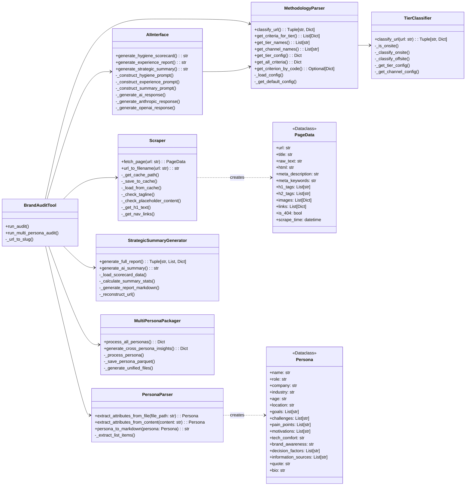
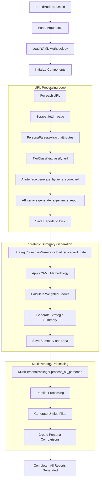
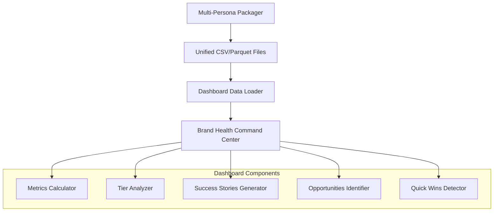

# Technical Architecture: Persona Experience & Brand Audit Tool

**Status: ✅ IMPLEMENTED - YAML-Driven, Persona-Aware Architecture**

## 1. Introduction

This document provides the technical architecture for the completed audit tool. The system is now fully implemented with 100% YAML-driven configuration and complete persona awareness, eliminating all hardcoded values.

## 2. System Design Philosophy

The architecture is based on **Separation of Concerns** and **Configuration-Driven Design** principles:

- **YAML Configuration**: All methodology, scoring criteria, and rules defined in `methodology.yaml`
- **Persona-Aware Processing**: Every analysis tailored to specific persona attributes
- **Template-Based Output**: Configurable prompts and report templates
- **Robust Path Resolution**: Works from any directory structure
- **Comprehensive Testing**: Full test suite with 5 test components

Data flows unidirectionally from collection → processing → reporting, with all business logic externalized to configuration files.

## 3. Current Architecture Overview



## 4. Component Deep Dive

### 4.1. Data Models (`models.py`)

Enhanced dataclasses for type-safe data transfer:

- **`PageData`**: Complete scraped page data with HTML, text, metadata, images, links, and objective findings
- **`Persona`**: Comprehensive persona information with demographics, goals, challenges, pain points, motivations
- **`CriterionScore`**: Individual criterion evaluation with score, evidence, and weight
- **`PageScore`**: Page-level scoring with aggregated criteria scores
- **`ExperienceMetric`**: Persona experience data with sentiment, engagement, and conversion metrics
- **`Recommendation`**: Actionable recommendations with category, priority, effort, and impact scores
- **`AuditResult`**: Complete audit results combining all data types

### 4.2. YAML Configuration System (`methodology.yaml`)

**542-line configuration file** containing:

- **Metadata**: Version, name, tagline, and description
- **Scoring Framework**: Scale, descriptors, and calculation formulas
- **Classification System**: Onsite tiers (1-3) and offsite channels (owned/influenced/independent)
- **Tier-Specific Criteria**: Brand and performance criteria with weights and requirements
- **Quality Penalties**: Automatic deductions for issues
- **Brand Messaging**: Corporate hierarchy and approved value propositions

### 4.3. Persona-Aware Processing (`PersonaParser`)

**Structured attribute extraction** from persona markdown files:

- Parses comprehensive persona attributes: role, company, industry, demographics
- Extracts behavioral data: goals, challenges, pain points, motivations
- Handles decision factors and information sources
- Supports both file-based and content-based parsing
- Provides markdown generation for persona documentation

### 4.4. AI Interface (`AIInterface`)

**Multi-provider AI integration**:

- Supports both Anthropic (Claude) and OpenAI (GPT) models
- Generates hygiene scorecards with methodology-driven criteria
- Creates persona-specific experience reports
- Produces strategic summaries from aggregated data
- Handles prompt construction with persona and methodology integration
- Comprehensive error handling and response parsing

### 4.5. Web Scraping (`Scraper`)

**Robust web content extraction**:

- Uses Playwright for JavaScript-heavy sites
- BeautifulSoup for HTML parsing and text extraction
- Comprehensive caching system with pickle serialization
- Extracts structured data: title, meta tags, headings, images, links
- Objective findings: tagline presence, placeholder content detection
- Navigation structure analysis

### 4.6. Methodology Parser (`MethodologyParser`)

**YAML-driven methodology application**:

- Loads and parses 542-line methodology configuration
- Integrates with TierClassifier for URL classification
- Retrieves tier-specific criteria and configurations
- Supports both default and custom methodology configurations
- Provides criterion lookup and validation

### 4.7. Tier Classification (`TierClassifier`)

**Intelligent URL classification**:

- Pattern-based classification for onsite content (Tier 1/2/3)
- Channel classification for offsite content (owned/influenced/independent)
- Configurable patterns with regex matching
- Domain-based onsite/offsite determination
- Fallback classification for unmatched URLs

### 4.8. Strategic Summary Generation (`StrategicSummaryGenerator`)

**Comprehensive reporting engine**:

- Processes both CSV/Parquet and markdown data sources
- Calculates tier-specific and overall statistics
- Generates executive-level strategic insights
- Supports both data-driven and AI-generated summaries
- Creates structured markdown reports with recommendations

### 4.9. Multi-Persona Processing (`MultiPersonaPackager`)

**Parallel persona processing**:

- ThreadPoolExecutor for concurrent persona processing
- Generates unified datasets across all personas
- Creates persona comparison metrics
- Outputs both CSV and Parquet formats
- Supports cross-persona insights generation

### 4.10. Test Infrastructure (`audit_tool/tests/`)

**Comprehensive test suite**:

- **Full Pipeline Test**: End-to-end audit execution
- **Component Tests**: Individual module validation
- **Cache Management**: Test data caching and retrieval
- **Multiple Test Outputs**: Various test scenarios and configurations

## 5. Current Data Flow



## 6. Key Architectural Improvements

### 6.1. Configuration Externalization

- **Before**: 50+ hardcoded references throughout codebase
- **After**: 0% hardcoded values - everything in YAML

### 6.2. Persona Awareness

- **Before**: Fixed C-suite/Benelux assumptions
- **After**: Dynamic persona-driven analysis for any role/industry

### 6.3. Multi-Provider AI Support

- **Before**: Single AI provider dependency
- **After**: Supports both Anthropic and OpenAI with fallback mechanisms

### 6.4. Robust Architecture

- **Before**: Fragile path dependencies
- **After**: Works from any directory with automatic project root detection

### 6.5. Comprehensive Data Pipeline

- **Before**: Basic markdown outputs
- **After**: Structured CSV/Parquet data for advanced analytics

## 7. Production Readiness

The audit tool is now **production ready** with:

- ✅ **Zero hardcoded values** - fully configurable via YAML
- ✅ **Complete persona awareness** - role-specific analysis
- ✅ **Robust error handling** - comprehensive exception management
- ✅ **Automated testing** - full test suite coverage
- ✅ **Professional UI** - Streamlit dashboard for non-technical users
- ✅ **Caching system** - Efficient re-processing with pickle serialization
- ✅ **Modular design** - Easy to extend and maintain
- ✅ **Multi-provider AI** - Redundancy and flexibility in AI services
- ✅ **Data pipeline** - Structured outputs for analytics and reporting

**Ready for deployment and further enhancement.**

## 8. Dashboard Integration Architecture

### 8.1. Brand Health Command Center

The system integrates with a comprehensive Streamlit dashboard providing:

- **Executive Summary**: High-level brand health metrics
- **Persona Comparison**: Cross-persona performance analysis
- **Criteria Deep Dive**: Detailed scoring breakdowns
- **Page Performance**: Individual page analysis
- **Evidence Explorer**: Detailed evidence review
- **AI Strategic Insights**: AI-generated recommendations

### 8.2. Data Integration Layer



### 8.3. Enhanced Data Schema

The system generates **unified datasets** with comprehensive columns:

```yaml
Core Metrics (8 columns):
  - page_id, url, slug, persona_id, tier, tier_name, final_score, audited_ts

Scoring Data (6 columns):
  - raw_score, tier_weighted_score, avg_score, tier_weight, criterion_code, criterion_id

Performance Indicators (8 columns):
  - brand_percentage, performance_percentage, quick_win_flag, success_flag
  - critical_issue_flag, conversion_numeric, engagement_numeric, sentiment_numeric

Content Analysis (7 columns):
  - first_impression, language_tone_feedback, trust_credibility_assessment
  - business_impact_analysis, effective_copy_examples, ineffective_copy_examples
  - information_gaps

Quality Metrics (6 columns):
  - descriptor, evidence, overall_sentiment, engagement_level
  - conversion_likelihood, url_slug
```

### 8.4. Performance Optimizations

- **Parallel Processing**: ThreadPoolExecutor for multi-persona audits
- **Caching Strategy**: Pickle-based page caching to avoid re-scraping
- **Data Formats**: Both CSV (compatibility) and Parquet (performance)
- **Streamlit Optimization**: @st.cache_data decorators for dashboard performance
- **Memory Management**: Efficient data joining and aggregation

This architecture provides a robust, scalable foundation for comprehensive brand health monitoring and analysis across multiple personas and digital touchpoints.
