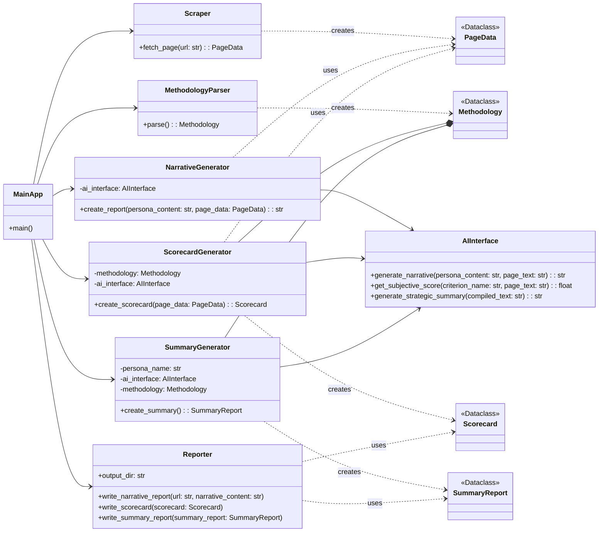
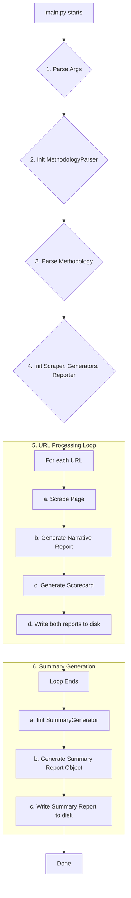

# Technical Architecture: Persona Experience & Brand Audit Tool

## 1. Introduction

This document provides a detailed technical architecture for the tool. It is intended for developers and outlines the classes, data models, and interactions required to implement the system described in the Functional Specification.

## 2. System Design Philosophy

The architecture is based on the **Separation of Concerns** principle. Each module has a single responsibility (scraping, AI interaction, scoring, reporting), making the system easier to develop, test, and maintain. Data flows in one direction, from collection to processing to reporting.

We will use Python dataclasses for structured data transfer between modules to ensure type safety and clarity.

## 3. Class Diagram

## 4. Component Deep Dive

### 4.1. Data Models (`models.py`)

A dedicated file defines a series of dataclasses for clear, type-safe data transfer.

- **`PageData`**: The primary data object for a scraped page.
  - `url: str`, `raw_text: str`, `is_404: bool`, `objective_findings: dict`
- **`Methodology`**: Holds the entire scoring framework, parsed from markdown.
  - Contains lists of `Tier` and `OffsiteChannel` objects.
- **`Tier` / `OffsiteChannel`**: Defines a specific scoring context (e.g., "Tier 1" or "Owned Media").
  - Contains a list of `Criterion` objects.
- **`Criterion`**: A single scoring rule (e.g., "Clarity of Messaging").
  - `name: str`, `weight: float`
- **`Scorecard`**: The structured data for a single page's audit.
  - `url: str`, `final_score: float`, `tier_name: str`
  - `scored_criteria: List[ScoredCriterion]`: A list of the actual scores given.
- **`ScoredCriterion`**: A `Criterion` after scoring.
  - `name: str`, `weight: float`, `score: float`, `notes: str`
- **`SummaryReport`**: Holds all aggregated data for the final report.
  - Includes overall scores, tier-based scores, ranked page lists, and the AI-generated qualitative summary (`executive_summary`, `key_strengths`, `key_weaknesses`).

### 4.2. Scraper (`scraper.py`)

- **Class:** `Scraper`
- **Method:** `fetch_page(self, url: str) -> PageData`
  - Uses `requests` and `BeautifulSoup` for simplicity and speed on static content.
  - Caches results in `cache/` to avoid repeated fetches during development.
  - Extracts all text and populates a `PageData` object.
  - _Note: Does not currently perform complex objective checks; this is handled by the AI._

### 4.3. AI Interface (`ai_interface.py`)

- **Class:** `AIInterface`
- **Dependencies:** `anthropic` SDK.
- **Method:** `generate_narrative(self, persona_content: str, page_text: str) -> str`
  - Builds a robust, multi-part prompt that instructs the AI to emulate the provided persona.
  - The prompt explicitly asks the AI to analyze the content from the persona's point of view, identify relevant copy, and structure the output with a table and narrative.
- **Method:** `get_subjective_score(self, criterion_name: str, page_text: str) -> float`
  - Builds a tightly constrained prompt asking for a single numerical score (0.0-10.0) for a given criterion based on the page text.
  - Returns a single float.
- **Method:** `generate_strategic_summary(self, compiled_text: str) -> str`
  - Takes the concatenated text of all narrative reports.
  - Prompts the AI to perform a thematic analysis and return a single, raw, valid JSON object containing an `executive_summary`, `key_strengths`, and `key_weaknesses`.
  - The system prompt and user prompt are engineered to maximize the chance of receiving valid JSON.

### 4.4. Generators (`generators.py`)

This file contains the logic for creating the content for the reports.

- **`NarrativeGenerator`**: A simple wrapper around the `AIInterface` call to maintain separation of concerns.
- **`ScorecardGenerator`**:
  - **Method:** `create_scorecard(self, page_data: PageData) -> Scorecard`
    - First classifies a page as "Onsite" or "Offsite".
    - It then classifies the page into a specific `Tier` or `OffsiteChannel` from the `Methodology`.
    - It iterates through the criteria for that class, calling `ai_interface.get_subjective_score(...)` for each one.
    - Calculates a final weighted score.
    - Constructs and returns a `Scorecard` object.
- **`SummaryGenerator`**:
  - **Method:** `create_summary(self) -> SummaryReport`
    - `_parse_scorecards()`: Reads all generated `*_hygiene_scorecard.md` files from the output directory and extracts quantitative data.
    - `_synthesize_narratives()`: Reads all `*_experience_report.md` files, concatenates them, and calls `ai_interface.generate_strategic_summary(...)`. It includes a helper function `_extract_json_from_response` to robustly parse the AI's JSON output, even if it's imperfect.
    - Aggregates all quantitative and qualitative data into a single `SummaryReport` object.

### 4.5. Reporter (`reporter.py`)

- **Class:** `Reporter`
- **Dependencies:** `Jinja2`
- **Method:** `write_narrative_report(...)`
  - Saves the raw string from the `NarrativeGenerator` to a file.
- **Method:** `write_scorecard(self, scorecard: Scorecard)`
  - Renders the `scorecard_template.md` template with the `Scorecard` object.
- **Method:** `write_summary_report(self, summary_report: SummaryReport)`
  - Renders the `summary_template.md` template with the `SummaryReport` object.

## 5. Data Flow

The data flow is orchestrated by `main.py`.

