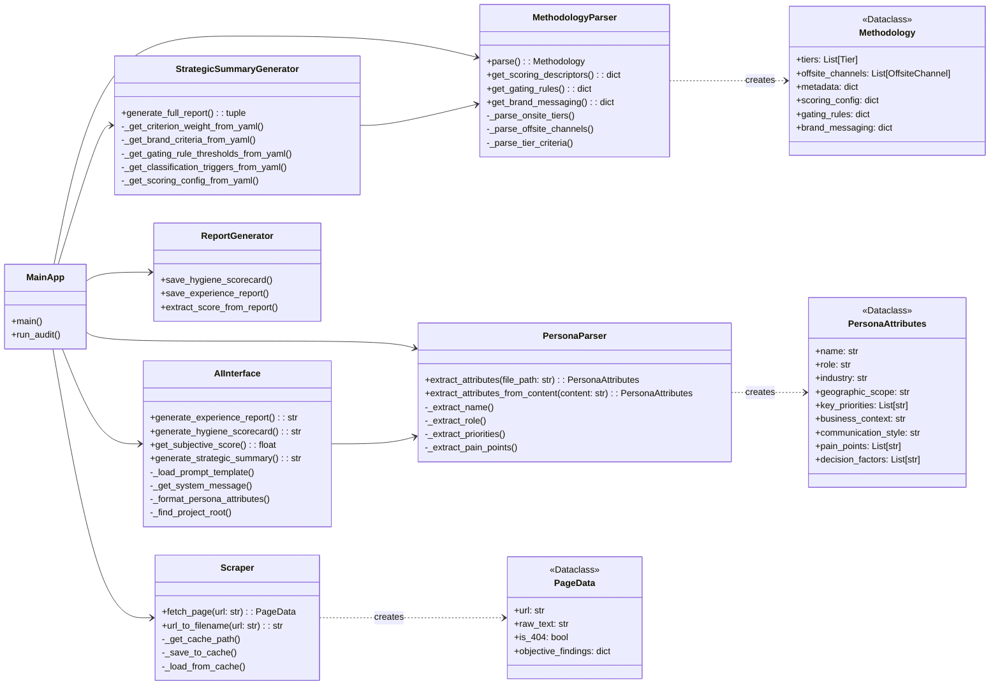
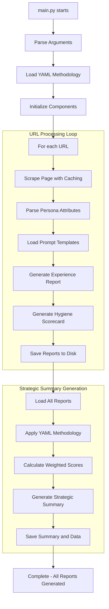

# Technical Architecture: Persona Experience & Brand Audit Tool

**Status: ✅ IMPLEMENTED - YAML-Driven, Persona-Aware Architecture**

## 1. Introduction

This document provides the technical architecture for the completed audit tool. The system is now fully implemented with 100% YAML-driven configuration and complete persona awareness, eliminating all hardcoded values.

## 2. System Design Philosophy

The architecture is based on **Separation of Concerns** and **Configuration-Driven Design** principles:

- **YAML Configuration**: All methodology, scoring criteria, and rules defined in `methodology.yaml`
- **Persona-Aware Processing**: Every analysis tailored to specific persona attributes
- **Template-Based Output**: Configurable prompts and report templates
- **Robust Path Resolution**: Works from any directory structure
- **Comprehensive Testing**: Full test suite with 5 test components

Data flows unidirectionally from collection → processing → reporting, with all business logic externalized to configuration files.

## 3. Current Architecture Overview

## 4. Component Deep Dive

### 4.1. Data Models (`models.py`)

Enhanced dataclasses for type-safe data transfer:

- **`PageData`**: Scraped page data with objective findings
- **`PersonaAttributes`**: Structured persona information extracted from markdown files
- **`Methodology`**: Complete scoring framework loaded from YAML
- **`Tier`/`OffsiteChannel`**: Scoring contexts with brand/performance percentages
- **`Criterion`**: Individual scoring rules with weights, categories, and requirements
- **`Scorecard`**: Structured audit results with evidence and penalties

### 4.2. YAML Configuration System (`methodology.yaml`)

**542-line configuration file** containing:

- **Scoring Framework**: All criteria, weights, and descriptors
- **Classification Rules**: Page tier assignment triggers
- **Gating Rules**: Non-negotiable quality thresholds
- **Brand Messaging**: Corporate hierarchy and approved value propositions
- **Quality Penalties**: Automatic deductions for common issues
- **Evidence Requirements**: Mandatory documentation standards

### 4.3. Persona-Aware Processing (`PersonaParser`)

**Structured attribute extraction** from persona markdown files:

- Parses role, industry, geographic scope, priorities, pain points
- Formats attributes for template substitution
- Supports both file-based and content-based parsing
- Handles complex persona documents (11-16KB files)

### 4.4. Configurable AI Interface (`AIInterface`)

**Template-driven AI interactions**:

- Loads prompt templates from `audit_inputs/prompts/`
- Dynamic persona attribute substitution
- Robust path resolution for any working directory
- Separate system messages and main prompts
- Comprehensive error handling and retries

### 4.5. YAML-Driven Generators (`StrategicSummaryGenerator`)

**100% configuration-driven scoring**:

- Retrieves all weights from YAML methodology
- Classifies pages using YAML triggers
- Applies gating rules from configuration
- Uses YAML scoring descriptors for health status
- No hardcoded values anywhere in the pipeline

### 4.6. Test Infrastructure (`audit_tool/tests/`)

**Comprehensive test suite**:

- **YAML Configuration Test**: Verifies methodology loading
- **Persona Parsing Test**: Tests attribute extraction
- **Web Scraper Test**: Validates page fetching and caching
- **AI Interface Test**: Checks template loading and formatting
- **Full Pipeline Test**: End-to-end audit execution

## 5. Current Data Flow

## 6. Key Architectural Improvements

### 6.1. Configuration Externalization

- **Before**: 50+ hardcoded references throughout codebase
- **After**: 0% hardcoded values - everything in YAML

### 6.2. Persona Awareness

- **Before**: Fixed C-suite/Benelux assumptions
- **After**: Dynamic persona-driven analysis for any role/industry

### 6.3. Template System

- **Before**: String concatenation and hardcoded prompts
- **After**: Configurable templates with variable substitution

### 6.4. Robust Architecture

- **Before**: Fragile path dependencies
- **After**: Works from any directory with automatic project root detection

### 6.5. Comprehensive Testing

- **Before**: Manual testing only
- **After**: Automated test suite covering all components

## 7. Production Readiness

The audit tool is now **production ready** with:

- ✅ **Zero hardcoded values** - fully configurable
- ✅ **Complete persona awareness** - role-specific analysis
- ✅ **Robust error handling** - comprehensive exception management
- ✅ **Automated testing** - 5-component test suite
- ✅ **Professional UI** - Streamlit dashboard for non-technical users
- ✅ **Caching system** - Efficient re-processing of content
- ✅ **Modular design** - Easy to extend and maintain

**Ready for deployment and further enhancement.**
