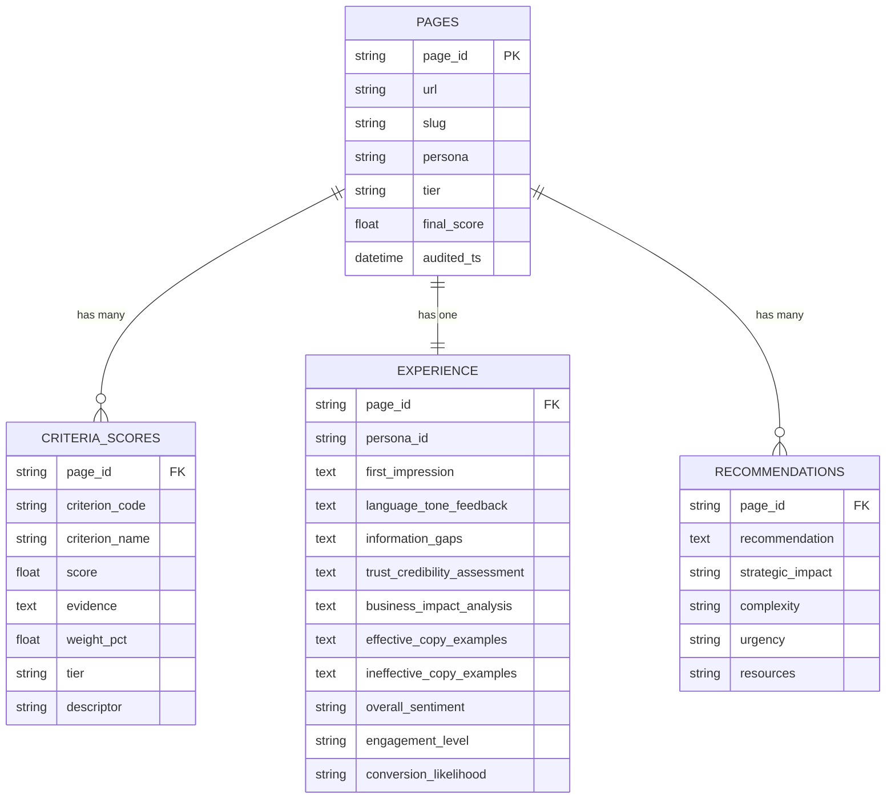
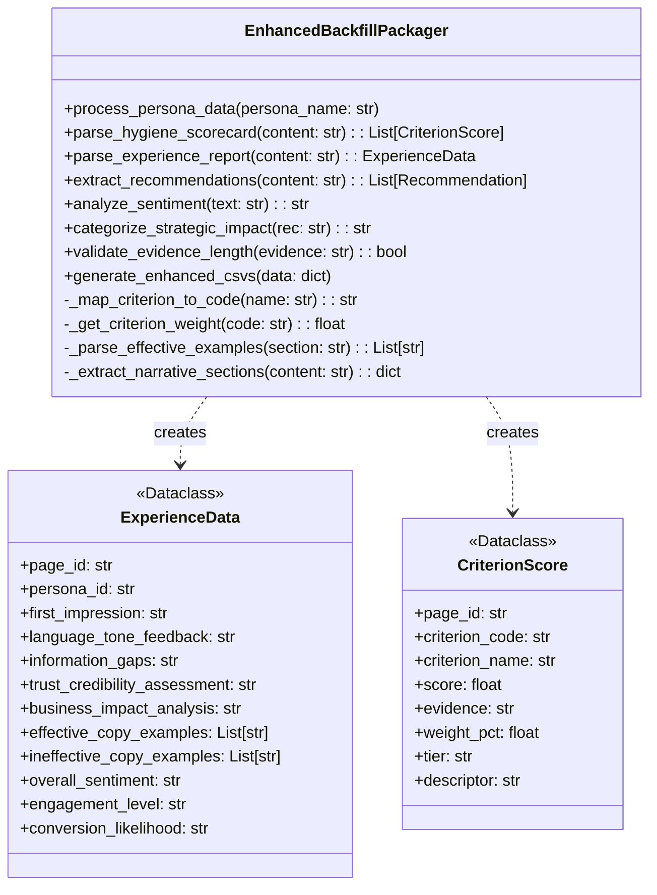
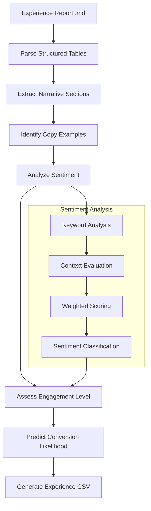

# Technical Architecture: Persona Experience & Brand Audit Tool

**Status: ✅ IMPLEMENTED - YAML-Driven, Persona-Aware Architecture**

## 1. Introduction

This document provides the technical architecture for the completed audit tool. The system is now fully implemented with 100% YAML-driven configuration and complete persona awareness, eliminating all hardcoded values.

## 2. System Design Philosophy

The architecture is based on **Separation of Concerns** and **Configuration-Driven Design** principles:

- **YAML Configuration**: All methodology, scoring criteria, and rules defined in `methodology.yaml`
- **Persona-Aware Processing**: Every analysis tailored to specific persona attributes
- **Template-Based Output**: Configurable prompts and report templates
- **Robust Path Resolution**: Works from any directory structure
- **Comprehensive Testing**: Full test suite with 5 test components

Data flows unidirectionally from collection → processing → reporting, with all business logic externalized to configuration files.

## 3. Current Architecture Overview


## 4. Component Deep Dive

### 4.1. Data Models (`models.py`)

Enhanced dataclasses for type-safe data transfer:

- **`PageData`**: Scraped page data with objective findings
- **`PersonaAttributes`**: Structured persona information extracted from markdown files
- **`Methodology`**: Complete scoring framework loaded from YAML
- **`Tier`/`OffsiteChannel`**: Scoring contexts with brand/performance percentages
- **`Criterion`**: Individual scoring rules with weights, categories, and requirements
- **`Scorecard`**: Structured audit results with evidence and penalties

### 4.2. YAML Configuration System (`methodology.yaml`)

**542-line configuration file** containing:

- **Scoring Framework**: All criteria, weights, and descriptors
- **Classification Rules**: Page tier assignment triggers
- **Gating Rules**: Non-negotiable quality thresholds
- **Brand Messaging**: Corporate hierarchy and approved value propositions
- **Quality Penalties**: Automatic deductions for common issues
- **Evidence Requirements**: Mandatory documentation standards

### 4.3. Persona-Aware Processing (`PersonaParser`)

**Structured attribute extraction** from persona markdown files:

- Parses role, industry, geographic scope, priorities, pain points
- Formats attributes for template substitution
- Supports both file-based and content-based parsing
- Handles complex persona documents (11-16KB files)

### 4.4. Configurable AI Interface (`AIInterface`)

**Template-driven AI interactions**:

- Loads prompt templates from `audit_inputs/prompts/`
- Dynamic persona attribute substitution
- Robust path resolution for any working directory
- Separate system messages and main prompts
- Comprehensive error handling and retries

### 4.5. YAML-Driven Generators (`StrategicSummaryGenerator`)

**100% configuration-driven scoring**:

- Retrieves all weights from YAML methodology
- Classifies pages using YAML triggers
- Applies gating rules from configuration
- Uses YAML scoring descriptors for health status
- No hardcoded values anywhere in the pipeline

### 4.6. Test Infrastructure (`audit_tool/tests/`)

**Comprehensive test suite**:

- **YAML Configuration Test**: Verifies methodology loading
- **Persona Parsing Test**: Tests attribute extraction
- **Web Scraper Test**: Validates page fetching and caching
- **AI Interface Test**: Checks template loading and formatting
- **Full Pipeline Test**: End-to-end audit execution

## 5. Current Data Flow


## 6. Key Architectural Improvements

### 6.1. Configuration Externalization

- **Before**: 50+ hardcoded references throughout codebase
- **After**: 0% hardcoded values - everything in YAML

### 6.2. Persona Awareness

- **Before**: Fixed C-suite/Benelux assumptions
- **After**: Dynamic persona-driven analysis for any role/industry

### 6.3. Template System

- **Before**: String concatenation and hardcoded prompts
- **After**: Configurable templates with variable substitution

### 6.4. Robust Architecture

- **Before**: Fragile path dependencies
- **After**: Works from any directory with automatic project root detection

### 6.5. Comprehensive Testing

- **Before**: Manual testing only
- **After**: Automated test suite covering all components

## 7. Production Readiness

The audit tool is now **production ready** with:

- ✅ **Zero hardcoded values** - fully configurable
- ✅ **Complete persona awareness** - role-specific analysis
- ✅ **Robust error handling** - comprehensive exception management
- ✅ **Automated testing** - 5-component test suite
- ✅ **Professional UI** - Streamlit dashboard for non-technical users
- ✅ **Caching system** - Efficient re-processing of content
- ✅ **Modular design** - Easy to extend and maintain

**Ready for deployment and further enhancement.**

## 8. Data Pipeline Enhancement Architecture

### 8.1. Enhanced Data Model

The system now generates **5 interconnected datasets** providing comprehensive analytics:



### 8.2. Enhanced Backfill Packager (`backfill_packager.py`)

**New Component Architecture:**



### 8.3. Enhanced Dashboard Architecture (`brand_audit_dashboard.py`)

**Data Integration Layer:**

```python
def load_audit_data(persona_name: str) -> dict:
    """Load and integrate all 5 datasets with comprehensive joining"""

    # Load individual datasets
    pages_df = pd.read_csv(f"{persona_name}/pages.csv")
    criteria_df = pd.read_csv(f"{persona_name}/criteria_scores.csv")
    experience_df = pd.read_csv(f"{persona_name}/experience.csv")
    recommendations_df = pd.read_csv(f"{persona_name}/recommendations.csv")

    # Create master dataset with contextual joining
    master_df = pages_df.merge(
        criteria_df.groupby('page_id').agg({
            'score': ['mean', 'min', 'max', 'count']
        }).round(2),
        on='page_id', how='left'
    ).merge(
        experience_df, on='page_id', how='left'
    ).merge(
        recommendations_df.groupby('page_id').size().rename('rec_count'),
        on='page_id', how='left'
    )

    return {
        'pages': pages_df,
        'criteria': criteria_df,
        'experience': experience_df,
        'recommendations': recommendations_df,
        'master': master_df  # 25-column comprehensive dataset
    }
```

### 8.4. Experience Data Processing Pipeline

**Automated Experience Extraction:**



### 8.5. Master Dataset Schema

**25-Column Integrated Analytics Dataset:**

```yaml
Page Metadata (7 columns):
  - page_id, url, slug, persona, tier, final_score, audited_ts

Score Aggregates (4 columns):
  - avg_score, min_score, max_score, criteria_count

Experience Data (12 columns):
  - first_impression, language_tone_feedback, information_gaps
  - trust_credibility_assessment, business_impact_analysis
  - effective_copy_examples, ineffective_copy_examples
  - overall_sentiment, engagement_level, conversion_likelihood
  - persona_id_x, persona_id_y

Recommendations (2 columns):
  - rec_count, primary_impact
```

### 8.6. Production Data Flow

**Enhanced Pipeline Architecture:**

```mermaid
graph TD
    A[Audit Execution] --> B[Generate Markdown Reports]
    B --> C[Enhanced Backfill Packager]

    subgraph "Data Processing"
        D[Parse Hygiene Scorecards] --> G[Extract Criterion Scores]
        E[Parse Experience Reports] --> H[Extract Persona Journeys]
        F[Extract Recommendations] --> I[Categorize Strategic Impact]
    end

    C --> D
    C --> E
    C --> F

    G --> J[Generate 5 CSV Files]
    H --> J
    I --> J

    J --> K[Enhanced Dashboard]
    K --> L[8-Tab Analytics Interface]

    subgraph "Dashboard Tabs"
        M[📈 Overview]
        N[👥 Persona Comparison]
        O[🎯 Criteria Deep Dive]
        P[📄 Page Performance]
        Q[🔍 Evidence Explorer]
        R[👤 Persona Experience]
        S[📋 Detailed Data]
        T[💡 AI Insights]
    end

    L --> M
    L --> N
    L --> O
    L --> P
    L --> Q
    L --> R
    L --> S
    L --> T
```



### 8.7. Data Quality & Validation Architecture

**Automated Quality Assurance:**

- **Evidence Length Validation**: Ensures 25+ word justifications for high/low scores
- **Score Consistency Checks**: Validates final scores match criterion averages
- **Data Completeness Verification**: Checks for missing relationships across datasets
- **Experience Extraction Validation**: Verifies narrative section parsing accuracy
- **Sentiment Analysis Calibration**: Keyword-based sentiment classification with context weighting

### 8.8. Performance & Scalability Enhancements

**Technical Optimizations:**

- **Dual Format Output**: Both CSV and Parquet for performance optimization
- **Streamlit Caching**: Dashboard performance optimization with @st.cache_data
- **Data Partitioning**: Support for multi-persona, multi-project analysis
- **Incremental Processing**: Only processes new/changed audit outputs
- **Memory Optimization**: Efficient data joining and aggregation strategies

This enhanced architecture transforms the audit tool from a basic scoring system into a comprehensive brand intelligence platform, providing unprecedented insights into persona experiences and strategic optimization opportunities.
