# Technical Architecture: Persona Experience & Brand Audit Tool

**Status: ✅ IMPLEMENTED - YAML-Driven, Persona-Aware Architecture with Automated Pipeline**

## 1. Introduction

This document provides the technical architecture for the completed audit tool. The system is now fully implemented with 100% YAML-driven configuration, complete persona awareness, and **automated single-click processing pipeline** that eliminates manual intervention.

## 2. System Design Philosophy

The architecture is based on **Separation of Concerns**, **Configuration-Driven Design**, and **Automated Pipeline Processing** principles:

- **YAML Configuration**: All methodology, scoring criteria, and rules defined in `methodology.yaml`
- **Persona-Aware Processing**: Every analysis tailored to specific persona attributes
- **Template-Based Output**: Configurable prompts and report templates
- **Automated Post-Processing**: Single-click pipeline from audit completion to dashboard integration
- **Robust Path Resolution**: Works from any directory structure
- **Comprehensive Testing**: Full test suite with 5 test components

Data flows unidirectionally from collection → processing → automated enhancement → dashboard integration, with all business logic externalized to configuration files.

## 3. Current Architecture Overview


## 4. Component Deep Dive

### 4.1. Data Models (`models.py`)

Enhanced dataclasses for type-safe data transfer:

- **`PageData`**: Complete scraped page data with HTML, text, metadata, images, links, and objective findings
- **`Persona`**: Comprehensive persona information with demographics, goals, challenges, pain points, motivations
- **`CriterionScore`**: Individual criterion evaluation with score, evidence, and weight
- **`PageScore`**: Page-level scoring with aggregated criteria scores
- **`ExperienceMetric`**: Persona experience data with sentiment, engagement, and conversion metrics
- **`Recommendation`**: Actionable recommendations with category, priority, effort, and impact scores
- **`AuditResult`**: Complete audit results combining all data types

### 4.2. YAML Configuration System (`methodology.yaml`)

**542-line configuration file** containing:

- **Metadata**: Version, name, tagline, and description
- **Scoring Framework**: Scale, descriptors, and calculation formulas
- **Classification System**: Onsite tiers (1-3) and offsite channels (owned/influenced/independent)
- **Tier-Specific Criteria**: Brand and performance criteria with weights and requirements
- **Quality Penalties**: Automatic deductions for issues
- **Brand Messaging**: Corporate hierarchy and approved value propositions

### 4.3. Persona-Aware Processing (`PersonaParser`)

**Structured attribute extraction** from persona markdown files:

- Parses comprehensive persona attributes: role, company, industry, demographics
- Extracts behavioral data: goals, challenges, pain points, motivations
- Handles decision factors and information sources
- Supports both file-based and content-based parsing
- Provides markdown generation for persona documentation

### 4.4. AI Interface (`AIInterface`)

**Multi-provider AI integration**:

- Supports both Anthropic (Claude) and OpenAI (GPT) models
- Generates hygiene scorecards with methodology-driven criteria
- Creates persona-specific experience reports
- Produces strategic summaries from aggregated data
- Handles prompt construction with persona and methodology integration
- Comprehensive error handling and response parsing

### 4.5. Web Scraping (`Scraper`)

**Robust web content extraction**:

- Uses Playwright for JavaScript-heavy sites
- BeautifulSoup for HTML parsing and text extraction
- Comprehensive caching system with pickle serialization
- Extracts structured data: title, meta tags, headings, images, links
- Objective findings: tagline presence, placeholder content detection
- Navigation structure analysis

### 4.6. Methodology Parser (`MethodologyParser`)

**YAML-driven methodology application**:

- Loads and parses 542-line methodology configuration
- Integrates with TierClassifier for URL classification
- Retrieves tier-specific criteria and configurations
- Supports both default and custom methodology configurations
- Provides criterion lookup and validation

### 4.7. Tier Classification (`TierClassifier`)

**Intelligent URL classification**:

- Pattern-based classification for onsite content (Tier 1/2/3)
- Channel classification for offsite content (owned/influenced/independent)
- Configurable patterns with regex matching
- Domain-based onsite/offsite determination
- Fallback classification for unmatched URLs

### 4.8. Strategic Summary Generation (`StrategicSummaryGenerator`)

**Comprehensive reporting engine**:

- Processes both CSV/Parquet and markdown data sources
- Calculates tier-specific and overall statistics
- Generates executive-level strategic insights
- Supports both data-driven and AI-generated summaries
- Creates structured markdown reports with recommendations

### 4.9. Multi-Persona Processing (`MultiPersonaPackager`)

**Parallel persona processing**:

- ThreadPoolExecutor for concurrent persona processing
- Generates unified datasets across all personas
- Creates persona comparison metrics
- Outputs both CSV and Parquet formats
- Supports cross-persona insights generation

### 4.10. Test Infrastructure (`audit_tool/tests/`)

**Comprehensive test suite**:

- **Full Pipeline Test**: End-to-end audit execution
- **Component Tests**: Individual module validation
- **Cache Management**: Test data caching and retrieval
- **Multiple Test Outputs**: Various test scenarios and configurations

### 4.11. Audit Post-Processor (`audit_post_processor.py`)

**Consolidated post-audit processing pipeline** that transforms raw audit outputs into dashboard-ready unified data:

**Core Functionality**:

- **Validation**: Checks audit output completeness (hygiene scorecards + experience reports)
- **Tier Classification**: Applies `TierClassifier` to all audited URLs
- **Backfill Processing**: Converts markdown files to structured CSV/Parquet using `EnhancedBackfillPackager`
- **Strategic Summary**: Generates executive insights via `StrategicSummaryGenerator`
- **Database Integration**: Adds processed data to unified multi-persona dataset via `MultiPersonaPackager`

**Integration Architecture**:

```python
# Simple usage
from audit_tool.audit_post_processor import process_completed_audit
success = process_completed_audit("Persona_Name", add_to_db=True)

# Advanced usage
processor = AuditPostProcessor("Persona_Name")
processor.process_audit_results()  # Run full pipeline
processor.add_to_database()        # Integrate with unified data
```

**Processing Pipeline**:

1. **Validate** audit output directory contains required markdown files
2. **Extract** URLs from audit files using regex pattern matching
3. **Classify** URLs into tiers (1/2/3) and channels (owned/influenced/independent)
4. **Process** markdown reports into structured datasets with tier-weighted scores
5. **Generate** strategic summary using processed CSV data
6. **Integrate** with unified multi-persona database for dashboard consumption

**UI Workflow Integration**:
The post-processor integrates seamlessly with the Streamlit Run Audit page:

```mermaid
sequenceDiagram
    participant User
    participant RunAuditPage
    participant AuditTool
    participant PostProcessor
    participant Dashboard

    User->>RunAuditPage: Upload persona + URLs
    RunAuditPage->>AuditTool: Execute audit
    AuditTool-->>RunAuditPage: ✅ Audit complete (raw files)

    Note over RunAuditPage: Shows "ADD TO DATABASE" button

    User->>RunAuditPage: Click "ADD TO DATABASE"
    RunAuditPage->>PostProcessor: process_audit_results()

    PostProcessor->>PostProcessor: 1. Validate output
    PostProcessor->>PostProcessor: 2. Classify tiers
    PostProcessor->>PostProcessor: 3. Process backfill
    PostProcessor->>PostProcessor: 4. Generate summary
    PostProcessor->>PostProcessor: 5. Add to database

    PostProcessor-->>RunAuditPage: ✅ Processing complete
    RunAuditPage->>RunAuditPage: Clear cache (st.cache_data.clear())
    RunAuditPage-->>User: "New data available - navigate to dashboard"

    User->>Dashboard: Navigate to other pages
    Dashboard-->>User: Shows new audit data immediately
```



**Error Handling & Recovery**:

- **Import Fallbacks**: Handles both relative and absolute imports
- **Validation Checks**: Ensures required files exist before processing
- **Graceful Degradation**: Continues processing even if some steps fail
- **Comprehensive Logging**: Detailed status updates for debugging

**Cache Management**:

- **Streamlit Cache Refresh**: Automatically clears `@st.cache_data` after processing
- **Immediate Data Availability**: New data visible without app restart
- **State Management**: Proper session state handling for multi-audit workflows

This component eliminates the previous 4-stage manual process, providing a single-click solution from audit completion to dashboard integration.

## 5. Current Data Flow


## 6. Key Architectural Improvements

### 6.1. Configuration Externalization

- **Before**: 50+ hardcoded references throughout codebase
- **After**: 0% hardcoded values - everything in YAML

### 6.2. Persona Awareness

- **Before**: Fixed C-suite/Benelux assumptions
- **After**: Dynamic persona-driven analysis for any role/industry

### 6.3. Multi-Provider AI Support

- **Before**: Single AI provider dependency
- **After**: Supports both Anthropic and OpenAI with fallback mechanisms

### 6.4. Robust Architecture

- **Before**: Fragile path dependencies
- **After**: Works from any directory with automatic project root detection

### 6.5. Comprehensive Data Pipeline

- **Before**: Basic markdown outputs
- **After**: Structured CSV/Parquet data for advanced analytics

## 7. Production Readiness

The audit tool is now **production ready** with:

- ✅ **Zero hardcoded values** - fully configurable via YAML
- ✅ **Complete persona awareness** - role-specific analysis
- ✅ **Robust error handling** - comprehensive exception management
- ✅ **Automated testing** - full test suite coverage
- ✅ **Professional UI** - Streamlit dashboard for non-technical users
- ✅ **Caching system** - Efficient re-processing with pickle serialization
- ✅ **Modular design** - Easy to extend and maintain
- ✅ **Multi-provider AI** - Redundancy and flexibility in AI services
- ✅ **Data pipeline** - Structured outputs for analytics and reporting

**Ready for deployment and further enhancement.**

## 8. Dashboard Integration Architecture

### 8.1. Current Dashboard Implementation (9 Pages)

**Executive Dashboard Layer:**

- **🎯 Brand Health Command Center** (`brand_health_command_center.py`): 30-second strategic decision engine

  - Real-time brand health metrics (distinctiveness, resonance, conversion)
  - Strategic assessment with tier filtering
  - Executive recommendations with actionable navigation
  - Automated insights and critical issue identification

- **📋 Reports & Export** (`6_📋_Reports_Export.py`): Professional report generation
  - Custom PDF exports with executive templates
  - Data export in multiple formats (CSV, Excel, JSON)
  - Automated report scheduling and delivery
  - Cross-persona comparative reports

**Analysis Dashboard Layer:**

- **👥 Persona Insights** (`2_👥_Persona_Insights.py`): Cross-persona performance analysis

  - Persona comparison matrices and heat maps
  - Performance benchmarking across personas
  - Persona-specific journey analysis
  - Conversion funnel optimization insights

- **📊 Content Matrix** (`3_📊_Content_Matrix.py`): Detailed performance by content type and tier

  - Tier-based performance analysis (Strategic/Tactical/Operational)
  - Content type effectiveness metrics
  - Performance correlation analysis
  - Content optimization recommendations

- **💡 Opportunity & Impact** (`4_💡_Opportunity_Impact.py`): Comprehensive improvement roadmap

  - Quick wins identification (high impact, low effort)
  - Strategic opportunity prioritization
  - ROI-based recommendation ranking
  - Implementation timeline planning

- **🌟 Success Library** (`5_🌟_Success_Library.py`): Pattern analysis and replication guides
  - High-performing content identification
  - Success pattern analysis and extraction
  - Replication framework development
  - Best practice documentation

**Technical Dashboard Layer:**

- **🔬 Methodology** (`1_🔬_Methodology.py`): Audit methodology and configuration

  - YAML methodology documentation
  - Scoring criteria explanation
  - Tier classification rules
  - Configuration management interface

- **🚀 Run Audit** (`7_🚀_Run_Audit.py`): Audit execution with automated post-processing
  - File upload interface (persona + URLs)
  - Real-time audit execution with live logging
  - **Automated post-processing** via "ADD TO DATABASE" button
  - Progress tracking and status monitoring

**Advanced Analysis Layer:**

- **🔍 Social Media Analysis** (`8_🔍_Social_Media_Analysis.py`): Cross-platform brand presence

  - Multi-platform engagement analysis
  - Content strategy effectiveness
  - Regional performance comparison
  - Social media optimization recommendations

- **👤 Persona Viewer** (`9_👤_Persona_Viewer.py`): Deep-dive persona analysis
  - Individual persona journey mapping
  - Voice analysis and sentiment tracking
  - Performance data integration
  - Persona-specific optimization strategies

### 8.2. Data Loading Architecture

**Unified Data Model** (`components/data_loader.py`):

```python
class BrandHealthDataLoader:
    """Centralized data loading with unified CSV architecture"""

    def load_unified_data(self) -> pd.DataFrame:
        """Load primary unified dataset from audit_data/unified_audit_data.csv"""

    def load_all_data(self) -> Tuple[Dict, pd.DataFrame]:
        """Load all datasets with legacy compatibility mapping"""

    def load_enhanced_data(self, persona_name: str) -> Dict[str, pd.DataFrame]:
        """Load persona-specific enhanced datasets"""

    def get_available_personas(self) -> List[str]:
        """Dynamic persona discovery from audit_outputs directory"""
```

**Data Flow Architecture:**


### 8.3. Automated Post-Processing Integration

**UI Integration Workflow:**

```mermaid
sequenceDiagram
    participant User
    participant RunAuditUI
    participant AuditTool
    participant PostProcessor
    participant DataLoader
    participant Dashboard

    User->>RunAuditUI: Upload persona + URLs
    RunAuditUI->>AuditTool: Execute audit
    AuditTool-->>RunAuditUI: ✅ Audit complete (markdown files)

    Note over RunAuditUI: Shows "ADD TO DATABASE" button

    User->>RunAuditUI: Click "ADD TO DATABASE"
    RunAuditUI->>PostProcessor: AuditPostProcessor.process_audit_results()

    PostProcessor->>PostProcessor: validate_audit_output() [10% → 20%]
    PostProcessor->>PostProcessor: classify_page_tiers() [20% → 40%]
    PostProcessor->>PostProcessor: run_backfill_processing() [40% → 60%]
    PostProcessor->>PostProcessor: generate_strategic_summary() [60% → 80%]
    PostProcessor->>PostProcessor: add_to_database() [80% → 90%]

    PostProcessor->>DataLoader: Clear cache (st.cache_data.clear()) [90% → 100%]
    PostProcessor-->>RunAuditUI: ✅ Processing complete

    RunAuditUI-->>User: "New data available - navigate to dashboard"

    User->>Dashboard: Navigate to any dashboard page
    Dashboard->>DataLoader: load_unified_data()
    DataLoader-->>Dashboard: Fresh data (including new audit)
    Dashboard-->>User: Shows new audit data immediately
```



**Key Integration Features:**

- **Single-Click Automation**: Eliminates manual 4-step process
- **Live Progress Tracking**: Real-time progress bars with detailed status
- **Automatic Cache Refresh**: New data available without app restart
- **Error Recovery**: Comprehensive validation and graceful error handling
- **State Management**: Proper session state for multi-audit workflows

### 8.4. Component Architecture

**Core Dashboard Components:**

```python
# Brand Styling Component
from components.brand_styling import get_complete_brand_css

# Data Loading Component
from components.data_loader import BrandHealthDataLoader

# Metrics Calculation Component
from components.metrics_calculator import BrandHealthMetricsCalculator

# Filter Management Component
from components.filter_manager import FilterManager
```

**Shared Styling System:**

- **Consistent Brand Colors**: Magnus Consulting color palette
- **Typography**: Inter + Crimson Text font combination
- **Component Library**: Reusable UI components across all pages
- **Responsive Design**: Mobile and tablet optimization

### 8.5. Performance Optimizations

**Caching Strategy:**

- **@st.cache_data**: Automatic caching for expensive data operations
- **Smart Cache Invalidation**: Targeted cache clearing after data updates
- **Memory Management**: Efficient handling of large datasets
- **Lazy Loading**: On-demand data loading for better performance

**Data Pipeline Efficiency:**

- **Unified CSV Architecture**: Single source of truth reduces data duplication
- **Parallel Processing**: Multi-threaded operations for large audit batches
- **Streaming Processing**: Memory-efficient handling of very large datasets
- **Smart Filtering**: Server-side filtering to reduce client-side processing

---

## 9. Production Readiness & Deployment

The audit tool is now **production ready** with:

- ✅ **Zero hardcoded values** - fully configurable via YAML
- ✅ **Complete persona awareness** - role-specific analysis
- ✅ **Automated processing pipeline** - single-click audit-to-dashboard workflow
- ✅ **Comprehensive dashboard** - 9 functional pages covering all user needs
- ✅ **Robust error handling** - comprehensive exception management
- ✅ **Automated testing** - full test suite coverage
- ✅ **Professional UI** - Streamlit dashboard for non-technical users
- ✅ **Intelligent caching** - Efficient re-processing with automatic cache management
- ✅ **Modular design** - Easy to extend and maintain
- ✅ **Multi-provider AI** - Redundancy and flexibility in AI services
- ✅ **Advanced analytics** - Structured outputs for deep insights and reporting

**Ready for enterprise deployment and continuous enhancement.**

---

_Document Version: 3.0_  
_Last Updated: January 2025_  
_Status: Updated to reflect complete automated pipeline and 9-page dashboard implementation_
